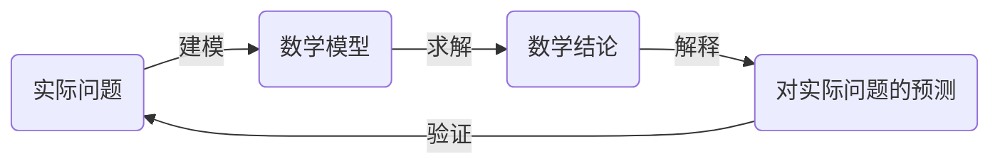

### 1.	函数的四种表示方法 ###

函数 f 是一个规则，按照它，集合A 中的每一个元素都恰好在集合 B 中有一个元素与之对应，称之为 f(x)

```title="函数表示方法"
1.	描述法 - 用自然语言描述
2.	数值法 - 用函数值的列表
3.	直观法 - 用函数图形
4.	代数法 - 用显式公式
```

- 如果一个函数用这四种方法都可以表示，我们通常可以将其从一种表示法转换到另一种以获得对其更多的认识
- 但是对于某个函数来说，肯定有一种表示法要比其他的更自然

```title=""
- 分段函数
- 递增&递减:
	- 函数f 称在区间I 上递增，如果 x1 和 x2 在I上 且 x1 < x2，则 f(x1) < f(x2)
	- 函数f 称在区间I 上递减，如果 x1 和 x2 在I上 且 x1 < x2，则 f(x1) > f(x2)
```

### 2.	数学模型：基本函数导引 ###

数学模型是{==对现实问题某种现象的数学描述==}（通常表达为函数或者方程），比如人口的数量、产品的需求量、落体的速度、化学反应中物质的浓度、初生儿生命的预期以及降低辐射的费用等问题。建模的目的是理解这些现象，如果可能的话对系统未来的行为作一些预测

1.	对于一个实际问题，首要任务是分析和确定 自变量 和 因变量 并为之命名，作一些假设使所研究的详细简化为数学上可以处理的程度，从而建立数学模型；我们通常利用自己的 物理 / 数学 技巧来得到联系这些变量的方法，若没有规律可用的情况下，我们需要采集数据（图书馆 / 物理 / 自身经验）并用表格来研究数据，以看清楚其分布；从函数的数值表达出发，通过数据描点，可用得到函数的图像。有时这种图像甚至能其实一个合适的代数表达
2.	将数学知识和工具要用到数学模型，设法给出数学问题的解答
3.	利用数学上的结论解释为原始实际问题的信息，依次说明现象或预测未来
4.	通过新的数据测试我们的预想结果；若预测与实现吻合度不好，我们有必要修正偶像或建立新模型，并重新开始循环

!!! tip
	数学模型永远不是自然界真实问题的精确表现————他只是理想化的东西



!!! note "数学模型"
> 线性模型 - 函数图像为一条直线
> 
> 多项式 - $p(x) = \sum\limits_{i=0}^n a_i \cdot x^i (a_n \ne 0)$
> 
> 	- 当 n=2 时，称为二次函数（二次多项式）
> 	- 多项式被普遍的用在自然和社会科学中的变量的建模上
> 
> 幂函数 - $f(x) = x^a$
> 
> 	1.	a=n (n为正整数) - f(x) = x^n
> 		- n取 奇数 或 偶数 时的图像不同 
> 		（并且 n越大, |x|<1时函数值接近x轴, |x|>1时函数值接近y轴）
> 		- n为正整数 & n为偶数，将值域划分为 x>=0 和 x<0 可得到不同的反函数：
> 			- $f^{-1}(x) = \sqrt[n]{x}$  &  $x \ge 0$
> 			- $f^{-1}(x) = -\sqrt[n]{x}$  &  $x < 0$
> 		- x < 0 时，$x = -\sqrt{(-x)^2} = -(\sqrt{-x})^2$
> 			（x为负的情况间接转换为正的情况，再根据反函数的性质得到上式）
> 	2.	$a=1/n$ (n为正整数) - $f(x) = \sqrt[n]x$
> 		- n取 奇数 或 偶数 时的图像不同
> 	3.	$a=-1 - f(x) = \frac1x$
> 		- 称为 倒数函数 或 坐标轴为渐近线的双曲线
> 
> 有理函数 - f(x) = P(x) / Q(x)  (P，Q均为多项式；定义域由使Q(x)!=0的x组成)
> 
> 代数函数 - 从多项式出发，由代数运算(+, -, *, /, 求方根)构成
> 
> 三角函数:
> 
> 	- 通常以弧度作为单位
> 	- $|\sin x| <= 1, |\cos x| <= 1  (x \in R, |f_x| <= 1)$
> 	- $\sin {(x + 2\cdot \pi)} = \sin x$, $\cos {(x + 2\cdot \pi)} = \cos x$  (通常用于对反复的现象建模)
> 	- $\tan x = sin(x)/cos(x)$, $x \ne (1/2+k)\cdot \pi$, $|\tan x| < +∞$
> 	- 余割/正割/余切函数 分别为 正弦/余弦/正切函数 的倒数
> 	
> 指数函数 - $f(x) = a^x (a > 0, x \in R, f_x > 0)$
> 
> 	- a < 1 或 a > 1 的图像不相同
>
> 对数函数 - $f(x) = \log_a{x} (a > 0, x > 0, f_x \in R)$
> 
> 	- 指数函数的反函数
> 	
> 超越函数 - {三角函数, 反三角函数, 指数函数, 对数函数}
> 
> 	- 一种非代数的函数

!!! tip
	- 各种模型之间是有交集的，事实上很难完全把函数进行划分得详细彻底
	- 即便是幂函数也很难求覆盖，更别说划分了
	- 一定区间的范围都可以 用 区间 或 有关绝对值的不等式 表示
		($x\in[a,b] \iff |x-\frac{a+b}{2}| \le \frac{b-a}{2}$)

!!! note "不太标准的venn图"
	```mermaid
	graph
	subgraph 超越函数
		三角函数
		反三角函数
		指数函数
		对数函数
		其他函数...
	end
	subgraph 代数函数
		subgraph 有理函数
			subgraph 多项式
				a(线性函数)
			end
			subgraph 幂函数
				b(线性函数)
			end
		end
	end
	```

!!! 常见的无理数
	- $\sqrt2$，$\pi$，$e$，黄金分割率$\phi$，欧拉数

!!! question
	- $x^x$，$log_x{a}$，$log_x{x}$ 及其 复合函数 又该如何定义？

### 3.	从基本函数衍生新的函数 ###

对 基本函数(数学模型) 的图像进行 平移/拉伸/反射 得到新的函数

并且使用 算术运算/复合 将两个函数结合在一起

!!! note "函数变换"
> 垂直/水平 平移: (假设 c > 0)
> 
> 	- y = f(x) + c，将 y = f(x)的图像向上平移c个单位距离
> 	- y = f(x) - c，将 y = f(x)的图像向下平移c个单位距离
> 	- y = f(x + c)，将 y = f(x)的图像向左平移c个单位距离
> 	- y = f(x - c)，将 y = f(x)的图像向右平移c个单位距离
> 
> 垂直/水平 拉伸/压缩/反射: (假设 c > 0)
> 
> 	- y = c * f(x)，将 y = f(x)的图像垂直拉伸 c 倍
> 	- y = 1/c * f(x)，将 y = f(x)的图像垂直压缩 c 倍
> 	- y = f(c * x)，将 y = f(x)的图像压缩拉伸 c 倍
> 	- y = f(1/c * x)，将 y = f(x)的图像水平拉伸 c 倍
> 	- y = - f(x)，将 y = f(x)的图像关于 x 轴反射
> 	- y = f(- x)，将 y = f(x)的图像水平 y 轴反射

!!! note
	- y = a * f(b * x) 即对 y=f(x) 的y轴放大a倍，对x轴放大1/b倍
	- 对三角函数 先进行 缩放 再进行 平移 才不易破坏其周期性

!!! note 组合函数 & 复合函数"
> 组合函数(函数的代数运算):  (假设 f, g 分别是定义域是 A, B 的函数)
> 
> 	- $(f+g)(x) = f_x + g_x$ (定义域为 $A \cap B$)
> 	- $(f-g)(x) = f_x - g_x$ (定义域为 $A \cap B$)
> 	- $(fg)(x) = f_x * g_x$ (定义域为 $A \cap B$)
> 	- $(\frac{f}{g})(x) = \frac{f_x}{g_x}$ (定义域为 $\{ x|x\in A \cap B, g_x != 0 \}$)
> 
> 复合函数 - (f o g)(x) = f(g(x))
> 
> 	- f o g 的定义域是 g的定义域(A)中所有使得 g_x 在f的定义域(B)中的x的值
> 	- 因此，f o g 的定义域必须是 g的定义域的子集(即，只要适当得划分g的定义域的子集就能求出f o g的定义域)

!!! note "复合函数定义域可能的两种算法"
	1.	先求出 f o g，再根据基本函数(或其组合形式)的定义域求出各种限制下x的解集，再对这些解集求交集
	2.	求出 g的值域 与 f的定义域 的交集，再通过此交集求解关于g_x的不等式，得到解集x

!!! tip
	- 对于 f o g o h，x先作用 h，再作用 g，然后作用 f

!!! question
	- f o g 有意义的等价条件是 g的值域是 f的定义域的子集？

### 4.	图形计算器与计算机 ###


### 5.	指数函数(p66) ###

!!! note "指数函数"
> 指数函数 $f(x) = a^x$ 的意义: (约定 a > 0)
> 
> 	- $x = n$ 为正整数 - $f_x$ 为n个a相乘
> 	- $x = 0$ - $f_x$ 为常数 1
> 	- $x = -n$ (n为正整数) - $f_x = 1 / (a^n)$
> 	- $x = p/q$ (p/q为有理数，q>0) - $f_x = a^{p/q} = \sqrt[q]{a^p} = \sqrt[q]{a}^p$
> 	- $x = 无理数$ - 取两个在 x 左右逼近的有理数，x 取其中之一以得到其函数值

```title="指数函数的应用"
```

```title="常数e"
每个指数在x=0处都有一个切线，若使该切线的值为1，则定义此时的a=e (exponential)
2 < e=2.71828 < 3
```

### 6.	反函数与对数函数 ###


!!! note "单射函数"
	单射函数 - 它从不取同样的函数值，即 $f_x1 \ne f_x2$，只要 $x1 \ne x2$
		- 水平线判定 - 一个函数是单射函数 $\iff$ 没有水平直线和它相交超过一次

!!! note
> 令 f 为定义域A，值域B的单射函数，则它的反函数 $f^{-1}$ 定义域为 B，值域为 A，
> 
> 定义为 $f^{-1}{y} = x  \iff  f(x) = y$ (或 $f^{-1}{x} = y  \iff  f(y) = x$)，对任意的 y属于B

!!! note
	- $f^{-1}定义域 = f 值域$
	- $f^{-1}值域 = f 定义域$

!!! warning
	- $f^{-1}$ 并不意味着 f 的倒数
	- 关于求反函数的问题一定要注意2个点：是否为单射函数(如果不是则分类讨论)，原函数定义域是什么

!!! note "反函数 的性质"
> $f^{-1}(f(x)) = x$  对每一个x 属于 A
> $f(f^{-1}(x)) = x$  对每一个x 属于 B

!!! question "能否这样替代上述性质？"
	- $f^{-1} o f o h = h$ 对每一个 x 属于 A
	- $f o f^{-1} o h = h$ 对每一个 x 属于 B

!!! note "计算单射函数f 的反函数"
> 1.	写出 y = f(x)
> 2.	解出这个关于x的方程，用 y 表示 x (如果可能)
> 3.	为了将 $f^{-1}$ 表示为x的函数，将 x 和 y 互换
> 4.	最终得到方程 $y = f^{-1}(x)$

!!! note "反函数的图像"
	$f^{-1}$ 的图像可以通过 f 的图像 关于 y=x 对称得到 (也即 x 和 y 互换)

!!! note "对数函数"
> 若 $a > 0$ 且 $a\ne 1$，指数函数 $f(x) = a^x$ 不是递增就是递减，可以判断它是单射函数，因此有反函数 $f^{-1}$
> 
> 因此，$log_a{x} = y  \iff  a^y=x$
> 
> 又由反函数的定义，有
> 
> 	- $log_a{a^x} = x$ & $x \in R$
> 	- $a^{log_a{x}} = x$ & $x > 0$

!!! note "对数定律"
> 1.	$log_a{xy} = log_a{x} + log_a{y}$
> 2.	$log_a{x/y} = log_a{x} - log_a{y}$
> 3.	$log_a{x^r} = log_a{x} * r$

!!! note "自然对数"
> $log_e{x} = ln{x}$
> 
> 	- $ln_x = y \iff e^y = x$
> 	- $ln{e^x} = x$ & $x \in R$
> 	- $e^{ln{x}} = x$ & $x > 0$
> 	- 换底公式 - $log_a{x} = ln{x} / ln{a}$  &  $a>0, a!=1$

!!! note "反三角函数"
> 定义 $y = sin{x}$  &  $|x| \le \pi/2$ /*(1)*/ 的反函数为 $sin^{-1}$ 或 arcsin
> 
> 性质: (反函数的基本性质)
> 
> 	- $sin^{-1}{x}=y  \iff  sin{y}=x$  &  $|y| \le \pi/2$
> 	- $sin^{-1}{sin{x}} = x$  & $|x| \le \pi/2$
> 	- $sin{sin^{-1}{x}} = x$  & $|x| \le 1$
> 
> 定义 $y = cos{x}$  &  $|x-\pi/2| \le \pi/2$ 的反函数为 $cos^{-1}$ 或 arccos
> 
> 性质:
> 
> 	- $cos^{-1}{x}=y  \iff  cos{y}=x$  &  $|y-\pi/2| \le \pi/2$
> 	- $cos^{-1}{cos{x}} = x$  & $|x-\pi/2| \le \pi/2$
> 	- $cos{cos^{-1}{x}} = x$  & $|x| \le 1$
> 
> 定义 $y = tan{x}$  &  $|x| \lt \pi/2$ 的反函数为 $tan^{-1}$ 或 arctan
> 
> 性质:
> 
> 	- $tan^{-1}{x}=y  \iff  tan{y}=x$  &  $|y| \lt \pi/2$
> 	- $tan^{-1}{tan{x}} = x$  & $|x| \lt \pi/2$
> 	- $tan{tan^{-1}{x}} = x$  & $|x| \in R$
> 	- 水平渐近线 - $y = ±\pi/2$

1.	整个实数域R上的正弦函数不是单射函数，因此需要对范围做些限制才能转化为单射函数


!!! tip
	- 反三角函数的图像很明显都能通过其反函数与y=x对称得到
	- 给定一个反三角函数，可以根据它的参数构造一个三角形，而该反三角函数值就是它的一个关键的角(虽然只能直观的画出 \theta>0的情形)，以这个角为参数代入其他三角函数，即可得到新定义的函数与最原始的参数的关系
	- 为何 $x^2=..$ 解出的x可能有两种取值？
		- 我们必须定义幂函数$x^2$在两种定义域上的反函数，如 (-∞, 0) & [0, +∞)
		- 然后将方程两边代入反函数中分别能得到一种或两种 x 的解

!!! note "其他反三角函数"
> $y = csc^{-1}{x}$ & $|x| \ge 1  \iff  csc{y} = x$ & $y \in (0, \pi/2] \cup (\pi, 3\pi/2]$
> 
> $y = sec^{-1}{x}$ & $|x| \ge 1  \iff  sec{y} = x$ & $y \in [0, \pi/2) \cup [\pi, 3\pi/2)$
> 
> $y = cot^{-1}{x}$ & $x \in R  \iff  cot{y} = x$ & $y \in (0, \pi)$
> 
> // 余割/正割 定义的区间可以合理地改变


