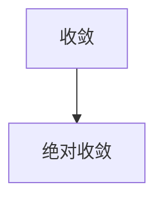

### 1.序列 ###

!!! 序列
	- 序列是有一定顺序的一列数，并且是定义在 正整数集 上的函数，写作 $a_n$
	- 序列 $\{ a_1, a_2, a_3, ... \}$ 也记作 $\{ a_n \}$ 或 $\{ a_n \}_{n=1}^∞$
	- 如： $a_n \iff \{ a_n = \frac {n}{n+1} \} \iff \{ \frac 12, \frac 23, \cdots, \frac n{n+1}, \cdots \}$

!!! note "“隐式序列”"
	- 这些序列往往不能以简单的等式定义
	- 如：Fibonacci序列 ($f_1 = f_2 = 1, f_n = f_{n-1} + f_{n-2}, n\ge 3$)
	- 又如：$\{ a_n \}$ 为常数 e 在第 n 位小数上的数字，即 $\{ 7, 1, 8, 2, 8, \cdots \}$
	- 再如：$\{ P_n \}$ 表示年份 n 的一月世界人口数

!!! 几何表示
	- 一维数轴上的离散的点：$(1, a_1), (2, a_2), (3, a_3), \cdots$
	- 二维笛卡尔坐标系中的离散点

!!! 序列极限
> 序列 $\{ a_n \}$ 具有极限 L 且记作 $\lim\limits_{n\to \infty} = L$
> 
> 或 $a_n \to L$ 当 $n\to \infty$
> 
> 若通过取充分大的 n 我们可以使项 $a_n$ 任意接近 L，
> 
> 若 $\lim\limits_{n\to ∞} a_n$ 存在，我们称此序列 收敛 (或 是收敛的)，否则称此发散 (或 是发散的)

!!! 序列极限的精确描述
> 序列 $\{ a_n \}$ 具有极限 L 且记作 $\lim\limits_{n\to ∞} a_n = L$ 或 $a_n \to L$ 当 $n\to \infty$
> 
> 若对任意小的 $\epsilon > 0$ 存在相应的整数 N，只要 $n > N$，就有 $|a_n - L| < \epsilon$

!!! note "如何理解？"
	1.	$\{ a_n \}$ 在一维数轴上，无论区间 $(L -\epsilon, L + \epsilon)$ 取得多小，都存在一个 N，使得序列中 $a_{N+1}$ 往后的所有项都落在这个区间里
		
	2.	$\{ a_n \}$ 在二维笛卡尔坐标系上，当 n > N 时 $\{ a_n \}$ 的图像必然位于水平线 $y = L + \epsilon$ 和 $y = L - \epsilon$ 之间，无论对多小的 $\epsilon$，这个图像都是对的，但越小的 $\epsilon$ 就对应越大的 N
		

!!! note "定理(连续函数极限 $\to$ 序列极限)"
> 若 $\lim\limits_{x\to ∞}f(x) = L$ 且 当 n 为整数时有 $f(n) = a_n$，则 $\lim\limits_{n\to ∞}a_n = L$

!!! 无穷大极限
> $\lim\limits_{n\to ∞} a_n = ∞$ 意味着对任意正数 M，存在整数 N，对任意的 n > N 使得 $a_n > M$

!!! note "序列的极限定律"
> $\{ a_n \}$ 和 $\{ b_n \}$ 为收敛序列，c 为常数，则：
> 
> $\lim\limits_{n\to ∞}(a_n + b_n) = \lim\limits_{n\to ∞}a_n + \lim\limits_{n\to ∞}b_n$，$\lim\limits_{n\to ∞}(a_n - b_n) = \lim\limits_{n\to ∞}a_n - \lim\limits_{n\to ∞}b_n$
> 
> $\lim\limits_{n\to ∞}c\cdot a_n = c\cdot \lim\limits_{n\to ∞} a_n$，$\lim\limits_{n\to ∞}c = c$
> 
> $\lim\limits_{n\to ∞}a_n\cdot b_n = \lim\limits_{n\to ∞} a_n \cdot \lim\limits_{n\to ∞} b_n$，$\lim\limits_{n\to ∞}\frac {a_n}{b_n} = \frac {\lim\limits_{n\to ∞} a_n}{\lim\limits_{n\to ∞} b_n}$  &  $\lim\limits_{n\to ∞} b_n\ne 0$
> 
> $\lim\limits_{n\to ∞} a_n^p = (\lim\limits_{n\to ∞} a_n)^p$  & $p > 0, a_n > 0$

!!! note "夹逼定理"
> 若对 $n\ge n_0$ 有 $a_n\le b_n \le c_n$ 且 $\lim\limits_{n\to ∞} a_n = \lim\limits_{n\to ∞} c_n = L$，则 $\lim\limits_{n\to ∞} b_n = L$

!!! note "\lim\limits_{n\to ∞} \frac {n!}{n^n}"
	- n! 在非整数域上没有定义，所以不能用 洛必达法则 或 泰勒展开
	- 可以考虑 夹逼定理

!!! 定理
> 若 $\lim\limits_{n\to ∞} |a_n| = 0$，则 $\lim\limits_{n\to ∞} a_n = 0$

!!! question
	- 周期函数 或 周期序列 在无穷远处都是 振荡的？（发散）

!!! note "$\{ r^n \}$ 的敛散性"
	- $\lim\limits_{n\to ∞} r^n = \begin{cases} 0 & |r|<1 \\ 1 & r=1 \\ ∞ & |r|>1 \\ -1\to 1振荡 & r=-1 \end{cases}$

!!! note "单调性"
> 若对所有 $n\ge 1$ 都有 $a_n < a_{n+1}$，则 $\{ a_n \}$ 称为递增的
> 
> 若对所有 $n\ge 1$ 都有 $a_n > a_{n+1}$，则 $\{ a_n \}$ 称为递减的
> 
> 递增 或 递减 都被称为单调
> 
> tip：还可以利用连续函数的导函数判断 序列单调性

!!! note "有界性"
> 序列 $\{ a_n \}$ 有上界，若存在数 M 使得 $a_n \le M$ 对所有 $n\ge 1$
> 
> 序列 $\{ a_n \}$ 有下界，若存在数 m 使得 $a_n \ge m$ 对所有 $n\ge 1$
> 
> 若它既有 上界 又有 下界，则 $\{ a_n \}$ 是有界序列

!!! note "单调序列定理(证明：p15)"
> 任何 {==有界==}，{==单调==} 的序列都是收敛的（递增，有上界 或 递减，有下界）

!!! tip
	此定理基于 完备性定理：若 S 为非空实数集并由上界 M（对所有 x 属于 S 有 $x\le M$），则 S 有一个最小上界 b

!!! tip
	- 研究递归序列时经常用到数学归纳法，如证明 单调性 或 有界性
	- 在数学归纳之前往往要打表找规律
	- 证明序列 单调 并 有界 后，此时就能通过方程 $\lim\limits_{n\to ∞} a_{n+1} = f(L), \lim\limits_{n\to ∞} a_n = L$ 求解极限了

### 2.级数 ###

!!! 无穷级数
	- 我们尝试将无穷序列 $\{ a_n \}_{n=1}^∞$ 的各项加起来，得到 $\sum\limits_{n=1}^∞ a_n$ 或 $\sum a_n$

!!! 无穷级数
> 已知级数 $\sum\limits_{n=1}^∞$，令 $s_n$ 为其第 n 个部分和(前缀和)： $s_n = \sum\limits_{i=1}^n a_i$
> 
> 若序列 $\{ s_n \}$ 收敛且 $\lim\limits_{n\to ∞} s_n = s$ 作为实数存在，则级数 $\sum a_n$ 称为收敛的，
> 
> 且我们即 $a_1 + a_2 + \cdots + a_n + \cdots = s$ 或 $\sum\limits_{n=1}^∞ a_n = s$数 s 称为级数的和；否则，级数被称为发散的
> 
> 注意： $\sum\limits_{n=1}^∞ a_n = \lim\limits_{n\to ∞}\sum\limits_{i=1}^n a_i$

!!! tip
	- 无穷级数 类似于 函数在无穷处的反常积分，如 $\int_a^∞ f(x)~d_x = \lim\limits_{t\to ∞}\int_a^t f(x)~d_x$
	- 为了求无穷级数，我们先从 1..n 求和，再令 $n\to ∞$；为了求反常积分，我们先从 a 积到 t，然后令 $t\to ∞$
	- 无穷级数的三种表示：$\lim\limits_{n\to ∞} \sum\limits_{i=1}^n a_i$，$\sum\limits_{i=1}^∞ a_i$，$\lim\limits_{n\to ∞} s_n$

!!! 几何级数
	{align=right}

	- $\sum\limits_{n=1}^∞ a\cdot r^{n-1}, a\ne 0$
	- 若 r=1，则 $s_n = \sum\limits_{i=1}^n a = n\cdot a \to ±∞$，因为 $\lim\limits_{n\to ∞} s_n$ 不存在，这种情况下几何级数发散
	- 若 $r\ne 1$，由 $s_n = \sum\limits_{i=0}^{n-1}a\cdot r^i$，$r\cdot s_n = \sum\limits_{i=1}^{n}a\cdot r^i$，可得 $s_n = a\cdot \frac {1-r^n}{1-r}$
		- 若 $|r| < 1$，则 $\lim\limits_{n\to∞} s_n = \lim\limits_{n\to ∞} s_n = a\cdot \frac {1-r^n}{1-r} = \frac {a}{1-r}$，此时几何级数收敛 且和为 $\frac a{1-r}$
		- 若 $r \le -1$ 或 $r > 1$，此时几何级数发散

!!! 几何级数
> $\sum\limits_{n=1}^∞ a r^{n-1}$ 是收敛的，若 |r| < 1，它的和为 $\sum\limits_{n=1}^∞ ar^{n-1} = \frac a{1-r}, |r| < 1$
> 
> 若 $|r| \ge 1$，几何级数发散
> 
> 即： $\sum\limits_{n=1}^∞ a r^{n-1} = \begin{cases} \frac {a}{1-r} & |r|<1 \\ ∞ & r=1 或 |r|>1 \\ -a \to 0 振荡 & r=-1 \end{cases}$

!!! question
	- $\lim\limits_{n\to ∞} a_n$ 发散 $\to$ $\lim\limits_{n\to ∞} \sum\limits_{i=1}^n a_i$ 发散？

!!! note
	- $\sum\limits_{i=1}^∞ 2^{2i}3^{1-n}$，$2.3\overline{17}=2.3171717\cdots$ 均可转化为几何级数
	- $\sum\limits_{i=1}^∞ (f_{i+1} - f_{i})$ 收敛，仅当 $\lim\limits_{n\to ∞}f_{n+1}-f_1$ 存在

!!! 调和级数
	- 证明调和级数 $\sum\limits_{i=1}^∞ \frac 1i$ 发散：
	- 令 $s_n = \sum\limits_{i=1}^n \frac 1i$，有 $s_{2^n} = \sum\limits_{i=1}^{2^n} \frac 1i$
	- 其中 $\displaystyle s_{\displaystyle 2^n} = \sum\limits_{i=1}^{2^n} \frac 1i = 1 + \sum\limits_{i=1}^n \sum\limits_{j=2^{i-1}+1}^{2^i} \frac 1j \ge 1 + \sum\limits_{i=1}^n(2^i-(2^{i-1}+1)-1) \frac {1}{2^i} = 1  + \sum\limits_{i=1}^n\frac {2^{i-1}}{2^i} = 1 + \frac n2$
	- $\lim\limits_{n\to ∞} 1+\frac n2$ 发散 $\implies$ $\lim\limits_{n\to ∞} s_{\displaystyle 2^n}$ 发散 $\implies$ $\lim\limits_{n\to ∞} s_n$ 发散

!!! note "定理(收敛推论)"
> 若 $\sum\limits_{n=1}^∞ a_n$ 收敛，则 $\lim\limits_{n\to ∞} a_n = 0$
> 
> 逆命题不成立

!!! 发散的判别法
> 若 $\lim\limits_{n\to ∞} a_n$ 不存在 或 $\lim\limits_{n\to ∞} a_n \ne 0$，则级数 $\lim\limits_{n\to ∞} \sum\limits_{i=1}^n a_i$ 发散

!!! note
	- $\lim\limits_{n\to ∞} a_n$ 不存在 或 不为0 $\implies$ 级数发散
	- $\lim\limits_{n\to ∞} a_n = 0$，级数可能 发散 或 收敛

!!! 定理
> 若 $\sum a_n$ 和 $\sum b_n$ 为收敛级数，则级数 $\sum c\cdot a_n$ (c 为常数)，$\sum (a_n + b_n)$，$\sum (a_n - b_n)$ 也收敛，且
> 
> 	- $\sum\limits_{n=1}^∞ c\cdot a_n = c\sum\limits_{n=1}^∞ a_n$
> 	- $\sum\limits_{n=1}^∞ (a_n + b_n) = \sum\limits_{n=1}^∞ a_n + \sum\limits_{n=1}^∞ b_n$
> 	- $\sum\limits_{n=1}^∞ (a_n - b_n) = \sum\limits_{n=1}^∞ a_n - \sum\limits_{n=1}^∞ b_n$

!!! note
	- 级数的有限项不影响它的 收敛性 或 发散性：假设 $\sum\limits_{n=N+1}^∞ a_n$ 是收敛的 ($N \ge 0$)，那么 $\sum\limits_{n=1}^∞ a_n$ 也是收敛的

### 3.和式的积分判别法 & 估计 ###

接下来介绍的判别法使得我们 {==不用求出级数具体的和==} 就能确定其是否收敛

!!! note "idea"
	- 设 $a_i$ 是 $f(x)$ 的生成数列，并且 $f(x)$ 为 $[0, ∞)$ 上的 {==连续递减的正值函数==}
	- 那么 $\int_{i}^{i+1} f(x)~d_x \le a_i \le \int_{i-1}^{i} f(x)~d_x$
	- 同样的有： $\sum\limits_{i=n}^∞\int_{i}^{i+1} f(x)~d_x \le \sum\limits_{i=n}^∞a_i \le \sum\limits_{i=n}^∞\int_{i-1}^{i} f(x)~d_x \iff \int_{n}^∞ f(x)~d_x \le \sum\limits_{i=n}^∞a_i \le \int_{n-1}^{∞} f(x)~d_x$
	- 注意：上式中 n 应该取适当的值，以使不等式左右两边的积分都是有限值（否则意义不大，如： $\int_0^∞ f_x d_x$ 和 $\int_1^∞ f_x d_x$ 后者是有限值并且极限为 1）

!!! note
	- $\sum\limits_{n=1}^∞ \frac 1{n^2} \approx \frac {\pi^2}{6}$ （由 Euler 证明）
	- 上述证明相当困难，但是可以用积分证明 $\sum\limits_{n=1}^∞ \frac 1{n^2} < 2$
	- $\sum\limits_{n=1}^∞ \frac 1{\sqrt n}$ 的敛散性也用类似的方法证明

!!! 积分判别法
> 设 f 为 [0, +∞) 上的{==连续==}、取{==正值==}的{==(基本)递减==}函数
> 
> 令 $a_n = f(n)$，则级数 $\sum\limits_{n=1}^∞ a_n$ 收敛 $\iff$ 反常积分 $\int_1^∞ f(x)~d_x$ 收敛
> 
> 换句话说：
> 
> - $\int_1^∞ f(x)~d_x$ 收敛，则 $\sum\limits_{n=1}^∞ a_n$ 收敛
> - $\int_1^∞ f(x)~d_x$ 发散，则 $\sum\limits_{n=1}^∞ a_n$ 发散

!!! tip
	- 基本递减：指的是 x > N 时 f 递减
	- 积分判别法 {==未必要在1处开始积分==}
	- 更通用的说法：
		- $\int_{h-1}^∞ f(x)~d_x$ 收敛，则 $\sum\limits_{n=h}^∞ a_n$ 收敛
		- $\int_h^∞ f(x)~d_x$ 发散，则 $\sum\limits_{n=h}^∞ a_n$ 发散

!!! note "{==p级数==}"
	- $\displaystyle \lim\limits_{n\to∞} \frac 1{n^p} = \begin{cases} +∞ & p < 0 \\ 1 & p = 0 \\ 0 & p>0 \end{cases}$
	- 但是 $\displaystyle \sum\limits_{i=1}^∞ \frac 1{n^p} = \begin{cases} 收敛 & p > 1 \\ 发散 & p \le 1 ​\end{cases}$

!!! 估计级数的和

!!! 积分判别法的余项估计
> 假设 $f(k) = a_k$，其中 f 是在 $x\ge n$ 上连续，取正值的递减函数，$\sum a_n$ 收敛
> 
> 若 $R_n = s - s_n = \sum\limits_{i=n+1}^{∞} a_i$，则 $\int_{n+1}^{+∞}~d_x \le R_n \le \int_{n}^{+∞} f(x)~d_x$
> 
> 因而：$s_n + \int_{n+1}^{+∞}~d_x \le s_n + R_n = s \le s_n + \int_{n}^{+∞} f(x)~d_x$

!!! 积分判别法的证明

### 4.比较判别法 ###

将所给的级数 与 一个已知收敛或发散的计数进行比较

!!! 比较判别法
> 假设 $\sum a_n$，$\sum l_n$，$\sum r_n$ 是各项都为正的级数
> 
> 1.	若 $\sum r_n$ 收敛且对所有的 n 都有 $a_n \le r_n$，则 $\sum a_n$ 也收敛
> 2.	若 $\sum l_n$ 发散且对所有的 n 都有 $a_n \ge l_n$，则 $\sum a_n$ 也发散
> 
> 证明详见 p38
> 
>  细节：仅需 $n\ge \lceil N\rceil$ 也能使结论成立（级数的收敛性不受有限项的影响）

!!! 例子
	- 有理函数
	- $\sum\limits_{n=1}^∞ \frac {\ln x}{x}$

!!! 极限的比较判别法
> 假设 $\sum a_n$ 和 $\sum b_n$ 是各项都为正的计数，
> 
> 若 $\lim\limits_{n\to ∞}\frac {a_n}{b_n} = c$ （c为有限数，且 $c > 0$），则两边都 收敛 或 发散

!!! 估计和
> 若对于所有的 n，$a_n \le b_n$，我们有 $R_n \le T_n$

### 5.交错级数 ###

目前位置我们讨论的级数都是为正数的，接下来介绍重要的技术：交错级数

!!! 交错级数收敛性的判别
> $\sum\limits_{i=1}^∞ (-1)^{n-1}a_i$ ($a_i > 0$)
> 
> 满足：
> 
> 1.	对所有 n，$a_{i} \ge a_{i+1}$
> 2.	$\lim\limits_{n\to ∞}a_n = 0$
> 
> 则，此级数收敛

!!! note "估计和(交错级数估计定理)"
> 若 $s = \sum (-1)^{n-1}b_n$ 为交错级数，满足：
> 
> 1.	$b_n\ge b_{n+1} \ge 0$
> 2.	$\lim\limits_{n\to ∞}b_n = 0$
> 
> 则 $|R_n| = |s - s_n| = \le b_{n+1}$ （即 s 在 $s_n$ 两侧“波动”，误差为 $b_{n+1}$）

!!! tip
	- 任何收敛级数的 部分和$s_n$ 都可以用作 总和$s$ 的一个近似，但如果不能估计其精确值就没有多少意义了
	- 当问及 “精确到 m 位小数” 时，选取合适的 n，使得 $[(s_n + b_{n+1}) \cdot 10^m] = [(s_n - b_{n+1}) \cdot 10^m]$

### 6.绝对收敛 & 比值 / 根值 判别法 ###

!!! 绝对收敛
> 级数 $\sum a_n$ 称为绝对收敛的，若其绝对值级数 $\sum |a_n|$ 收敛

!!! 条件收敛
> 级数 $\sum a_n$ 称为条件收敛的，若它收敛但非绝对收敛的

!!! 定理
> 若级数 $\sum a_n$ 是绝对收敛的，则它一定是收敛的

!!! warning
	- $\lim\limits_{i=1}^∞ \frac {\cos i}{i^2}$ 不能直接用 比较判别法，因为不能保证对于所有 n 有 $\cos i \ge 0$，应当间接地取绝对值证明其收敛性，再推出原级数收敛

!!! 比值判别法
> 1.	若 $\lim\limits_{n\to ∞}|\frac {a_{n+1}}{a_n}| = L < 1$，则级数 $\sum\limits_{n=1}^∞ a_n$ 绝对收敛（从而收敛）
> 2.	若 $\lim\limits_{n\to ∞}|\frac {a_{n+1}}{a_n}| = L > 1$ 或 $\lim\limits_{n\to ∞}|\frac {a_{n+1}}{a_n}| = +∞$ ，则级数 $\sum\limits_{n=1}^∞ a_n$ 发散
> 3.	若 $\lim\limits_{n\to ∞}|\frac {a_{n+1}}{a_n}| = 1$，比值判别法{==无法确定==}收敛性（即得不到有关 $\sum a_n$ 的收敛性 或 发散性的结论）
> 
> 相关证明：p48

!!! 根值判别法
> 1.	若 $\lim\limits_{n\to ∞}\sqrt[n] {|a_n|} = L < 1$，则级数 $\sum\limits_{n=1}^∞ a_n$ 绝对收敛（从而收敛）
> 2.	若 $\lim\limits_{n\to ∞}\sqrt[n] {|a_n|} = L > 1$ 或 $\lim\limits_{n\to ∞}\sqrt[n] {|a_n|} = L = ∞$，则级数 $\sum\limits_{n=1}^∞ a_n$ 发散
> 3.	若 $\lim\limits_{n\to ∞} \sqrt[n]{|a_n|} = 1$，根值判别法{==失效==}

!!! 重排
> 一个已知 收敛级数 “是 绝对收敛 还是 条件收敛” 与 “无限项和 是否与 有限项和 行为相同” 的两个命题之间有一种联系
>
> 结论：
> 
> 1.	若 $\sum a_n$ 绝对收敛 且和为 s，则 $\sum a_n$ 的任意重排的和 $\sum a_{p_n}$ 为 s
> 2.	若 $\sum a_n$ 为条件收敛级数，r 为任意实数，则总存在 $\sum a_n$ 的一个重排使得重排后级数的和为 r （由黎曼证明）
> 
> 详见p51

### 7.判别级数收敛的策略 ###

判别级数的收敛性 与 函数的积分 类似，并没有确定的，快速的准则来确定已知级数用什么方法判别，但任可以优化判别收敛性的效率

!!! 级数判别策略
> 1.	若级数形如 {==$\sum \frac {1}{n^p}$==} (p—级数)，则 {==p > 1 时收敛==}， $p\le 1$ 时发散
> 2.	若级数形如 {==$\sum a\cdot r^{n-1}$ 或 $\sum a\cdot r^{n}$==} (几何级数)，则 {==|r| < 1 时收敛==}， $|r|\ge 1$ 时发散，将级数转化成这种形式可能需要一些初等代数的方法
> 3.	若级数具有 p—级数 或 几何级数 类似的形式，应考虑 {==比较判别法==}
> 
> 		- 特别地，若 $a_n$ 是 n 的 有理函数 或 代数函数（包含多项式根），则应该与 p—级数 比较（只保留分子和分母中 n 的最高次）
>		- 比较判别法 适用于正项级数，若 $\sum a_n$ 含有负项，我们可以对 $\sum |a_n|$ 使用 比较判别法，判别绝对收敛性 (见 11.4 练习)
>
> 4.	若发现 $\lim\limits_{n\to ∞} \ne 0$，那么就应该用 {==发散判别==}
> 5.	若级数有如 $\sum (-1)^{n-1} a_n$ 或 $\sum (-1)^n b_n$ 的形式，那显然 {==交错级数收敛性判别法==} 有用
> 6.	包含 阶乘 或 其他乘积（包含一个到第 n 次幂的不变的增长）用 {==比值判别法==} 经常比较方便
>		-	注意：对所有 p—级数 都有：$n\to ∞$ 时 $|\frac {a_{n+1}}{a_{n}}| \to 1$，因此所有是 n 的 有理函数 或 代数函数 的级数都是这样；也就是说，比值判别法 对此类函数都不适用
> 	
> 7.	若 $a_n$ 是 $(b_n)^n$ 的形式，则 {==根值判别法==} 可能有用
> 8.	若 $a_n = f(n)$，其中 $\int_1^{+∞} f(x)~d_x$ 易于计算，则 {==积分判别法==} 会有效

!!! tip
	- 注意 比值判别法 和 根值判别法 有时无法确定收敛性

### 8.幂级数 ###

!!! 幂级数
> 幂级数形如：$\sum\limits_{n=0}^∞ c_n\cdot x^n = c_0 + c_1\cdot x + c_2\cdot x^2 + \cdots$
> 
> 该级数的和是一个函数 $f(x) = c_0 + c_1\cdot x + \cdots + c_n\cdot x^n + \cdots$，定义域为 使级数收敛的 x 的集合（类似于一个多项式，唯一的区别就是 f 有无穷多项）
> 
> $c_n = 常数$ 时，幂级数 就变成了 几何级数，仅当 $|x| < 1$ 时收敛
> 
> 幂级数一般形式：$\sum\limits_{n=0}^∞ c_n(x-a)^n = c_0 + c_1(x-a) + c_2(x-a)^2 + \cdots$ （此形式是书写惯例，即使 x = a；x = a 时，对所有 $n\ge 1$ 的各项都是 0，即 x=a 时该级数总收敛；该形式称为 (x-a) 处的幂级数 或 以 a 为中心的幂级数 或 关于 a 的幂级数）

!!! note
	- 经常会讨论幂级数与其他级数组合时，x 的取值范围（特别注意 比值判别法 或 根值判别法 有时不能确定敛散性，这时需要代入特殊点再判断）

!!! note
	- 幂级数主要用于表示 数学、物理、化学 中出现的一些最重要的函数
	- 比如 Bessel 贝塞尔函数

!!! 定理
> 对已知幂级数 $\sum\limits_{n=0}^∞ c_n(x-a)^n$ 只有三种可能性：
> 
> 1.	级数只有当 x=a 时收敛
> 2.	级数对所有的 x 收敛
> 3.	存在一个正数 R 使得级数当 |x-a| < R 时收敛，当 |x-a| > R 时发散 （端点处也可能 收敛！）
> 
> 其中 R 称为收敛半径（1, 2 情况分别对应 R=0 和 R=+∞）

|级数|收敛半径|收敛区间|备注|
|:-:|:-:|:-:|:-:|
|$\sum\limits_{n=0}^∞ x^n$|	R=1|	(-1, 1)|	几何级数|
|$\sum\limits_{n=0}^∞ n!\cdot x^n$|	R=0|	{0}|	|
|$\sum\limits_{n=1}^∞ \frac {(x-3)^n}{n}$|	R=1|	[2, 4)|	|
|$\displaystyle J_0 = \sum\limits_{n=0}^∞ \frac {(-1)^nx^{2n}}{2^{2n}(n!)^2}$|	R=∞|	(-∞, +∞)|	0次贝塞尔级数|

!!! note
	- 一般地，比值判别法 或 根值判别法 一个被用来确定收敛半径 R
	- 当 x 是收敛区间的端点时，比值判别法 和 根值判别法 总是会失效，此时就必须用其他判别法来判断

### 9.函数的幂级数展开 ###

将已知函数表示成无穷项的和，对 不是初等函数的不定积分，求解微分方程，用多项式近似函数 都很有用

!!! note
	- $\frac {1}{1-x}$，$\frac {1}{x+2}$，$\frac {x^3}{x+2}$ 均能通过代换得到幂级数收敛的模式，从而得到幂级数展开式
	- 幂级数展开的模式指：$\frac {a}{1-f_x}g_x$

!!! note "幂级数的 微分 & 积分"
> 若幂级数 $\sum c_n(x-a)^n$ 具有收敛半径 R > 0，则若下定义的函数 f
> 
> $f(x) = c_0 + c_1(x-a) + c_2(x-a)^2 + \cdots = \sum\limits_{n=0}^∞ c_n(x-a)^n$
> 
> 在区间 (a-R, a+R) 上是可微的(从而连续)，且
> 
> 1.	$f'(x) = \sum\limits_{n=1}^∞ nc_n(x-a)^{n-1}$
> 2.	$\int f(x)~d_x = C + c_0(x-a) + c_1\frac {(x-a)^2}{2} + \cdots = C + \sum\limits_{n=0}^∞ c_n\frac {(x-a)^{n+1}}{n+1}$  ($C = C_1 + ac_0$)
> 
> 收敛半径均是 R
> 
> 上述两式可以写成如下形式：
> 
> 3.	$\frac {d}{d_x}[\sum\limits_{n=0}^∞ c_n(x-a)^n] = \sum\limits_{n=0}^∞ \frac {d}{d_x}[c_n(x-a)^n]$
> 4.	$\int[\sum\limits_{n=0}^∞ c_n(x-a)^n]~d_x = \sum\limits_{n=0}^∞\int c_n(x-a)^n~d_x$

!!! warning
	1.	对于有限项和，和的导数就是导数的和，和的积分就是积分的和；而对于幂级数（有无限项），和的导数就是导数的和，和的积分就是积分的和，仍然成立
	2.	幂级数被微分或积分后 收敛半径 不变，并不意味着收敛区间不变
	3.	幂级数逐项积分的思想是解微分方程的一个有力基础

!!! note
	- 求一个函数 f(x) 的幂级数表示，可以使用两种方法，先假设 f(x) = g(x)
		- 对两边积分，将积分后的 f(x) 变换为幂级数形式，再微分：$g(x) = \frac {d}{d_x} [\int f(x)~d_x]$
		- 对两边微分，将微分后的 f(x) 变换为幂级数形式，再积分：$g(x) = \int [\frac {d}{d_x} f(x)]~d_x$ （注意讨论常数 C 的值）

!!! note
	- $\tan^{-1} x = \int \frac 1{a+x^2}~d_x = \int \sum\limits_{n=0}^∞ (-x^2)^n ~d_x = C + \sum\limits_{n=0}^∞ (-1)^n\frac {x^{2n+1}}{2n+1} = \sum\limits_{n=0}^∞ (-1)^n\frac {x^{2n+1}}{2n+1}$ （著名的 Gregory 格里高力级数，收敛区间为 [-1, 1]）
	- x = 1时有 $\frac {\pi}{4} = \sum\limits_{n=0}^∞ (-1)^n\frac {1}{2n+1}$ $\implies$ $\pi = 4\sum\limits_{n=0}^∞ (-1)^n\frac {1}{2n+1}$

### 10.泰勒级数 & 麦克劳林级数 ###

我们假设 f 为任意可以用幂级数表示的函数 $f(x) = \sum\limits_{n=0}^∞ c_n(x-a)^n$，|x-a| < R

$f(x) = C_0 + \sum\limits_{i=1}^∞ c_i(x-a)^i$ $\implies$ $f(a) = c_0$

$f'(x) = C_1 + \sum\limits_{i=2}^∞ c_i\cdot i\cdot (x-a)^{i-1}$ $\implies$ $f'(a) = c_1$

$f^"(x) = C_2\cdot 2 + \sum\limits_{i=3}^∞ c_i\cdot i(i-1)\cdot (x-a)^{i-2}$ $\implies$ $f^"(a) = c_2\cdot 2$

$\vdots$

$f^{(n)}(x) = c_n\cdot n! + \sum\limits_{i=n+1}^{∞} c_i  \frac{i!}{(i-n)!}(x-a)^{i-n}$ $\implies$ $f^{(n)}(a) = c_n\cdot n!$

因此，我们得到系数 $c_n = \frac {f^{(n)}(a)}{n!}$

!!! note "Taylor 级数"
> 若 f 在 a 点有幂级数表示(展开)，即，若 $f(x) = \sum\limits_{n=0}^∞ c_n(x-a)^n$，|x-a| < R
> 
> 则其系数由下面的公式给出：$c_n = \frac {f^{(n)}(a)}{n!}$
> 
> 即 $f(x) = \sum\limits_{n=0}^∞ \frac {f^{(n)}(a)}{n!} (x-a)^n$
> 
> f 在点 a 的第 n 次 Taylor 多项式：$T_n(x) = \sum\limits_{i=0}^n \frac {f^{(i)}(a)}{i!} (x-a)^i$
> 
> f 在点 a 的第 n 次 Taylor 余项：$R_n(x) = f(x) - T_n = f(x) - \sum\limits_{i=0}^n \frac {f^{(i)}(a)}{i!} (x-a)^i$

!!! tip
	- （如果存在）$f_x$ 在 x=a 处的一阶泰勒多项式为 $f_x$ 在 x=a 处的切线方程
	- 那么二阶多项式有什么含义？

!!! note "Maclaurin 级数"
> 对 a = 0 的 Taylor级数，有： $f(x) = \sum\limits_{n=0}^∞ \frac {f^{(n)}(0)}{n!} x^n$
> 
> 注：由于这种情形出现得多，所以给它一个单独的名字

!!! question
	- 什么时候 $f_x$ 可以用泰勒级数表示？（或 $f_x$ 何时能表示成幂级数的形式？）
		- 设 $R_n(x)$ 为泰勒级数 $\lim\limits_{n\to ∞} T_n(x)$ 的余项，其中 $T_n(x)$ 为泰勒多项式
		- 若可以证明 $\lim\limits_{n\to ∞} = 0$，则 $\lim\limits_{n\to ∞} T_n(x) = \lim\limits_{n\to ∞} [f(x)-R_n(x)] = f(x) - \lim\limits_{n\to ∞} R_n(x) = f(x)$

!!! 定理
> 若 $f(x) = T_n(x) + R_n(x)$，其中 $T_n(x)$ 是 f 在 a 点的第 n 次泰勒多项式，且 $\lim\limits_{n\to ∞} R_n(x)=0$
> 
> 对 $|x-a|<R$，则 f 在区间 $|x-a|<R$ 上等于它的泰勒级数的和

!!! note "Taylor 不等式"
> 为了证明 $\lim\limits_{n\to ∞} R_n(x)=0$，有如下结论：
> 
> 若 $|f^{(n+1)}(x)| \le M$，对 $|x-a|\le d$，
> 
> 则泰勒级数的余项 $R_n(x)$ 满足不等式 $|R_n(x)| \le \frac {M}{(n+1)!}|x-a|^{n+1}$，对 $|x-a|\le d$
> 
> 证明：详见 p70

!!! tip
	- 应用 Taylor 不等式证明 $\lim\limits_{n\to ∞} R_n(x)=0$ 时，该结论很有帮助：$\lim\limits_{n\to ∞}\frac {x^n}{n!}=0,\forall x\in R$
	- Taylor 不等式中的 M 也可以是“半径” d 的函数
	- Taylor 不等式是通过“夹逼”来证明 $f_x$ 能用幂级数表示的
	- Taylor 不等式 也可以用于{==计算函数的近似误差==}，误差为 $|R_n(x)| \le \frac {M}{(n+1)!}|x-a|^{n+1} \le M\frac {d^{n+1}}{(n+1)!}$

!!! note "常见 maclaurin 级数"
	- $\frac 1{1-x} = \sum\limits_{i=0}^∞ x^i, |x|<1$
	- $e^x = \sum\limits_{i=0}^∞ \frac {x^n}{n!}, |x|<+∞$
	- $\sin x = \sum\limits_{i=0}^∞ (-1)^n \frac {x^{2i+1}}{(2i+1)!}, |x|<+∞$
	- $\cos x = \sum\limits_{i=0}^∞ (-1)^n \frac {x^{2i}}{(2i)!}, |x|<+∞$
	- $\tan x = \sum\limits_{i=0}^∞ (-1)^n \frac {x^{2i+1}}{2i+1}, |x|\le 1$

!!! note "Taylor 级数的应用"
	1.	近似计算函数积分
	2.	求函数极限

!!! note "幂级数的乘法和除法"
	- 类似于 多项式的乘法和除法，通常用来计算幂级数的前 n 个非零项
	- $\frac {\sin x}{\cos x}$ 的幂级数除法似乎与公式表中的形式不太一样？

### 11.二项级数 ###

!!! 二项式定理
	- $(a+b)^n = \sum\limits_{i=0}^n \left( \begin{matrix} n\\i \end{matrix} \right) a^{n-i}b^i$
		- 其中 $\left( \begin{matrix} n\\i \end{matrix} \right) = \frac {\prod\limits_{j=0}^{i-1} (n-j) }{i!}, i\in[1,n], i\in N^+$，$\left( \begin{matrix} n\\0 \end{matrix} \right) = 1$
	- 令 a=1, b=x 有 $(1+x)^n = \sum\limits_{i=0}^n \left( \begin{matrix} n\\i \end{matrix} \right) x^i$
	- 而牛顿将 二项式定理 扩展到了 n 不再是正整数的情况！！！

计算 $(1+x)^k$ 的 maclaurin 级数，得到 $(1+x)^k = \sum\limits_{i=0}^∞ \frac {\prod\limits_{j=0}^{i-1} (n-j)}{i!}$

$|\frac {a_{i+1}}{a_i}| = |\frac {\prod\limits_{j=0}^{i} (k-j) / \prod\limits_{j=0}^{i-1} (k-j)} {(i+1)! / i!}| = \frac {|k-i|}{i+1} |x| = \frac {|1-\frac ki|}{1+\frac 1i}|x| \to |x|$，当 $i\to ∞$

由比值判别法，|x|<1 时收敛，|x|>1 时发散

!!! 二项级数
> 若 k 为实数，且 |x| < 1，则 $(1+x)^k = \sum\limits_{i=0}^∞ \left( \begin{matrix} k\\i \end{matrix} \right) x^i$
> 
> 其中 $\left( \begin{matrix} k\\i \end{matrix} \right) = \frac {\prod\limits_{j=0}^{i-1} (k-j) }{i!}, i\in[1,n], i\in N^+$，且 $\left( \begin{matrix} k\\0 \end{matrix} \right) = 1$
> 
> 收敛性：
> 
> 	- |x| < 1 处永远收敛
> 	- 若 $-1 < k \le 0$， x = 1 处也收敛
> 
> 另外，$k\in N^+$ 时，若 $i > k$，则 $\left( \begin{matrix} k\\i \end{matrix} \right) = 0$，这意味着 $k\in N^+$ 时二项式级数将退化为普通的二项级数（项数有限）

!!! note "二项级数的应用"
	- $\displaystyle \frac {1}{(1+x)^2} = \sum\limits_{i=0}^∞ \left( \begin{matrix} -2\\i \end{matrix} \right) x^i = \sum\limits_{i=0}^∞ (-1)^i(i+1)x^i$，$|x|<1$
	- $\displaystyle \frac {1}{\sqrt {4-x}} = \frac {1}{2\sqrt {1+(-\frac 14x)}} = \frac 12\sum\limits_{i=0}^∞ \left( \begin{matrix} -\frac 12\\i \end{matrix} \right) (-\frac 14x)^i$，$|-\frac 14x|<1 \implies |x|<4$ （注意：二项级数是以 x=0 为中心的，不能将原函数中 x+l 的形式直接替换为二项级数中的 x）

### 12.泰勒级数的应用 ###

!!! 使用多项式近似函数
> 详见 p83

!!! 应用于物理

