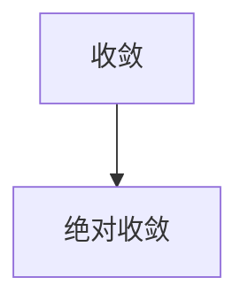

### 1.序列 ###

!!! 序列
	- 序列是有一定顺序的一列数，并且是定义在 正整数集 上的函数，写作 $a_n$
	- 序列 $\{ a_1, a_2, a_3, ... \}$ 也记作 $\{ a_n \}$ 或 $\{ a_n \}_{n=1}^∞$
	- 如： $a_n \iff \{ a_n = \frac {n}{n+1} \} \iff \{ \frac 12, \frac 23, \cdots, \frac n{n+1}, \cdots \}$

!!! note "“隐式序列”"
	- 这些序列往往不能以简单的等式定义
	- 如：Fibonacci序列 ($f_1 = f_2 = 1, f_n = f_{n-1} + f_{n-2}, n\ge 3$)
	- 又如：$\{ a_n \}$ 为常数 e 在第 n 位小数上的数字，即 $\{ 7, 1, 8, 2, 8, \cdots \}$
	- 再如：$\{ P_n \}$ 表示年份 n 的一月世界人口数

!!! 几何表示
	- 一维数轴上的离散的点：$(1, a_1), (2, a_2), (3, a_3), \cdots$
	- 二维笛卡尔坐标系中的离散点

!!! 序列极限
> 序列 $\{ a_n \}$ 具有极限 L 且记作 $\lim\limits_{n\to \infty} = L$
> 
> 或 $a_n \to L$ 当 $n\to \infty$
> 
> 若通过取充分大的 n 我们可以使项 $a_n$ 任意接近 L，
> 
> 若 $\lim\limits_{n\to ∞} a_n$ 存在，我们称此序列 收敛 (或 是收敛的)，否则称此发散 (或 是发散的)

!!! 序列极限的精确描述
> 序列 $\{ a_n \}$ 具有极限 L 且记作 $\lim\limits_{n\to ∞} a_n = L$ 或 $a_n \to L$ 当 $n\to \infty$
> 
> 若对任意小的 $\epsilon > 0$ 存在相应的整数 N，只要 $n > N$，就有 $|a_n - L| < \epsilon$

!!! note "如何理解？"
	1.	$\{ a_n \}$ 在一维数轴上，无论区间 $(L -\epsilon, L + \epsilon)$ 取得多小，都存在一个 N，使得序列中 $a_{N+1}$ 往后的所有项都落在这个区间里
		
	2.	$\{ a_n \}$ 在二维笛卡尔坐标系上，当 n > N 时 $\{ a_n \}$ 的图像必然位于水平线 $y = L + \epsilon$ 和 $y = L - \epsilon$ 之间，无论对多小的 $\epsilon$，这个图像都是对的，但越小的 $\epsilon$ 就对应越大的 N
		

!!! note "定理(连续函数极限 $\to$ 序列极限)"
> 若 $\lim\limits_{x\to ∞}f(x) = L$ 且 当 n 为整数时有 $f(n) = a_n$，则 $\lim\limits_{n\to ∞}a_n = L$

!!! 无穷大极限
> $\lim\limits_{n\to ∞} a_n = ∞$ 意味着对任意正数 M，存在整数 N，对任意的 n > N 使得 $a_n > M$

!!! note "序列的极限定律"
> $\{ a_n \}$ 和 $\{ b_n \}$ 为收敛序列，c 为常数，则：
> 
> $\lim\limits_{n\to ∞}(a_n + b_n) = \lim\limits_{n\to ∞}a_n + \lim\limits_{n\to ∞}b_n$，$\lim\limits_{n\to ∞}(a_n - b_n) = \lim\limits_{n\to ∞}a_n - \lim\limits_{n\to ∞}b_n$
> 
> $\lim\limits_{n\to ∞}c\cdot a_n = c\cdot \lim\limits_{n\to ∞} a_n$，$\lim\limits_{n\to ∞}c = c$
> 
> $\lim\limits_{n\to ∞}a_n\cdot b_n = \lim\limits_{n\to ∞} a_n \cdot \lim\limits_{n\to ∞} b_n$，$\lim\limits_{n\to ∞}\frac {a_n}{b_n} = \frac {\lim\limits_{n\to ∞} a_n}{\lim\limits_{n\to ∞} b_n}$  &  $\lim\limits_{n\to ∞} b_n\ne 0$
> 
> $\lim\limits_{n\to ∞} a_n^p = (\lim\limits_{n\to ∞} a_n)^p$  & $p > 0, a_n > 0$

!!! note "夹逼定理"
> 若对 $n\ge n_0$ 有 $a_n\le b_n \le c_n$ 且 $\lim\limits_{n\to ∞} a_n = \lim\limits_{n\to ∞} c_n = L$，则 $\lim\limits_{n\to ∞} b_n = L$

!!! note "\lim\limits_{n\to ∞} \frac {n!}{n^n}"
	- n! 在非整数域上没有定义，所以不能用 洛必达法则 或 泰勒展开
	- 可以考虑 夹逼定理

!!! 定理
> 若 $\lim\limits_{n\to ∞} |a_n| = 0$，则 $\lim\limits_{n\to ∞} a_n = 0$

!!! question
	- 周期函数 或 周期序列 在无穷远处都是 振荡的？（发散）

!!! note "$\{ r^n \}$ 的敛散性"
	- $\lim\limits_{n\to ∞} r^n = \begin{cases} 0 & |r|<1 \\ 1 & r=1 \\ ∞ & |r|>1 \\ -1\to 1振荡 & r=-1 \end{cases}$

!!! note "单调性"
> 若对所有 $n\ge 1$ 都有 $a_n < a_{n+1}$，则 $\{ a_n \}$ 称为递增的
> 
> 若对所有 $n\ge 1$ 都有 $a_n > a_{n+1}$，则 $\{ a_n \}$ 称为递减的
> 
> 递增 或 递减 都被称为单调
> 
> tip：还可以利用连续函数的导函数判断 序列单调性

!!! note "有界性"
> 序列 $\{ a_n \}$ 有上界，若存在数 M 使得 $a_n \le M$ 对所有 $n\ge 1$
> 
> 序列 $\{ a_n \}$ 有下界，若存在数 m 使得 $a_n \ge m$ 对所有 $n\ge 1$
> 
> 若它既有 上界 又有 下界，则 $\{ a_n \}$ 是有界序列

!!! note "单调序列定理(证明：p15)"
> 任何 {==有界==}，{==单调==} 的序列都是收敛的（递增，有上界 或 递减，有下界）

!!! tip
	此定理基于 完备性定理：若 S 为非空实数集并由上界 M（对所有 x 属于 S 有 $x\le M$），则 S 有一个最小上界 b

!!! tip
	- 研究递归序列时经常用到数学归纳法，如证明 单调性 或 有界性
	- 在数学归纳之前往往要打表找规律
	- 证明序列 单调 并 有界 后，此时就能通过方程 $\lim\limits_{n\to ∞} a_{n+1} = f(L), \lim\limits_{n\to ∞} a_n = L$ 求解极限了

### 2.级数 ###

!!! 无穷级数
	- 我们尝试将无穷序列 $\{ a_n \}_{n=1}^∞$ 的各项加起来，得到 $\sum\limits_{n=1}^∞ a_n$ 或 $\sum a_n$

!!! 无穷级数
> 已知级数 $\sum\limits_{n=1}^∞$，令 $s_n$ 为其第 n 个部分和(前缀和)： $s_n = \sum\limits_{i=1}^n a_i$
> 
> 若序列 $\{ s_n \}$ 收敛且 $\lim\limits_{n\to ∞} s_n = s$ 作为实数存在，则级数 $\sum a_n$ 称为收敛的，
> 
> 且我们即 $a_1 + a_2 + \cdots + a_n + \cdots = s$ 或 $\sum\limits_{n=1}^∞ a_n = s$数 s 称为级数的和；否则，级数被称为发散的
> 
> 注意： $\sum\limits_{n=1}^∞ a_n = \lim\limits_{n\to ∞}\sum\limits_{i=1}^n a_i$

!!! tip
	- 无穷级数 类似于 函数在无穷处的反常积分，如 $\int_a^∞ f(x)~d_x = \lim\limits_{t\to ∞}\int_a^t f(x)~d_x$
	- 为了求无穷级数，我们先从 1..n 求和，再令 $n\to ∞$；为了求反常积分，我们先从 a 积到 t，然后令 $t\to ∞$
	- 无穷级数的三种表示：$\lim\limits_{n\to ∞} \sum\limits_{i=1}^n a_i$，$\sum\limits_{i=1}^∞ a_i$，$\lim\limits_{n\to ∞} s_n$

!!! 几何级数
	{align=right}

	- $\sum\limits_{n=1}^∞ a\cdot r^{n-1}, a\ne 0$
	- 若 r=1，则 $s_n = \sum\limits_{i=1}^n a = n\cdot a \to ±∞$，因为 $\lim\limits_{n\to ∞} s_n$ 不存在，这种情况下几何级数发散
	- 若 $r\ne 1$，由 $s_n = \sum\limits_{i=0}^{n-1}a\cdot r^i$，$r\cdot s_n = \sum\limits_{i=1}^{n}a\cdot r^i$，可得 $s_n = a\cdot \frac {1-r^n}{1-r}$
		- 若 $|r| < 1$，则 $\lim\limits_{n\to∞} s_n = \lim\limits_{n\to ∞} s_n = a\cdot \frac {1-r^n}{1-r} = \frac {a}{1-r}$，此时几何级数收敛 且和为 $\frac a{1-r}$
		- 若 $r \le -1$ 或 $r > 1$，此时几何级数发散

!!! 几何级数
> $\sum\limits_{n=1}^∞ a r^{n-1}$ 是收敛的，若 |r| < 1，它的和为 $\sum\limits_{n=1}^∞ ar^{n-1} = \frac a{1-r}, |r| < 1$
> 
> 若 $|r| \ge 1$，几何级数发散
> 
> 即： $\sum\limits_{n=1}^∞ a r^{n-1} = \begin{cases} \frac {a}{1-r} & |r|<1 \\ ∞ & r=1 或 |r|>1 \\ -a \to 0 振荡 & r=-1 \end{cases}$

!!! question
	- $\lim\limits_{n\to ∞} a_n$ 发散 $\to$ $\lim\limits_{n\to ∞} \sum\limits_{i=1}^n a_i$ 发散？

!!! note
	- $\sum\limits_{i=1}^∞ 2^{2i}3^{1-n}$，$2.3\overline{17}=2.3171717\cdots$ 均可转化为几何级数
	- $\sum\limits_{i=1}^∞ (f_{i+1} - f_{i})$ 收敛，仅当 $\lim\limits_{n\to ∞}f_{n+1}-f_1$ 存在

!!! 调和级数
	- 证明调和级数 $\sum\limits_{i=1}^∞ \frac 1i$ 发散：
	- 令 $s_n = \sum\limits_{i=1}^n \frac 1i$，有 $s_{2^n} = \sum\limits_{i=1}^{2^n} \frac 1i$
	- 其中 $\displaystyle s_{\displaystyle 2^n} = \sum\limits_{i=1}^{2^n} \frac 1i = 1 + \sum\limits_{i=1}^n \sum\limits_{j=2^{i-1}+1}^{2^i} \frac 1j \ge 1 + \sum\limits_{i=1}^n(2^i-(2^{i-1}+1)-1) \frac {1}{2^i} = 1  + \sum\limits_{i=1}^n\frac {2^{i-1}}{2^i} = 1 + \frac n2$
	- $\lim\limits_{n\to ∞} 1+\frac n2$ 发散 $\implies$ $\lim\limits_{n\to ∞} s_{\displaystyle 2^n}$ 发散 $\implies$ $\lim\limits_{n\to ∞} s_n$ 发散

!!! note "定理(收敛推论)"
> 若 $\sum\limits_{n=1}^∞ a_n$ 收敛，则 $\lim\limits_{n\to ∞} a_n = 0$
> 
> 逆命题不成立

!!! 发散的判别法
> 若 $\lim\limits_{n\to ∞} a_n$ 不存在 或 $\lim\limits_{n\to ∞} a_n \ne 0$，则级数 $\lim\limits_{n\to ∞} \sum\limits_{i=1}^n a_i$ 发散

!!! note
	- $\lim\limits_{n\to ∞} a_n$ 不存在 或 不为0 $\implies$ 级数发散
	- $\lim\limits_{n\to ∞} a_n = 0$，级数可能 发散 或 收敛

!!! 定理
> 若 $\sum a_n$ 和 $\sum b_n$ 为收敛级数，则级数 $\sum c\cdot a_n$ (c 为常数)，$\sum (a_n + b_n)$，$\sum (a_n - b_n)$ 也收敛，且
> 
> 	- $\sum\limits_{n=1}^∞ c\cdot a_n = c\sum\limits_{n=1}^∞ a_n$
> 	- $\sum\limits_{n=1}^∞ (a_n + b_n) = \sum\limits_{n=1}^∞ a_n + \sum\limits_{n=1}^∞ b_n$
> 	- $\sum\limits_{n=1}^∞ (a_n - b_n) = \sum\limits_{n=1}^∞ a_n - \sum\limits_{n=1}^∞ b_n$

!!! note
	- 级数的有限项不影响它的 收敛性 或 发散性：假设 $\sum\limits_{n=N+1}^∞ a_n$ 是收敛的 ($N \ge 0$)，那么 $\sum\limits_{n=1}^∞ a_n$ 也是收敛的

### 3.和式的积分判别法 & 估计 ###

接下来介绍的判别法使得我们 {==不用求出级数具体的和==} 就能确定其是否收敛

!!! note "idea"
	- 设 $a_i$ 是 $f(x)$ 的生成数列，并且 $f(x)$ 为 $[0, ∞)$ 上的 {==连续递减的正值函数==}
	- 那么 $\int_{i}^{i+1} f(x)~d_x \le a_i \le \int_{i-1}^{i} f(x)~d_x$
	- 同样的有： $\sum\limits_{i=n}^∞\int_{i}^{i+1} f(x)~d_x \le \sum\limits_{i=n}^∞a_i \le \sum\limits_{i=n}^∞\int_{i-1}^{i} f(x)~d_x \iff \int_{n}^∞ f(x)~d_x \le \sum\limits_{i=n}^∞a_i \le \int_{n-1}^{∞} f(x)~d_x$
	- 注意：上式中 n 应该取适当的值，以使不等式左右两边的积分都是有限值（否则意义不大，如： $\int_0^∞ f_x d_x$ 和 $\int_1^∞ f_x d_x$ 后者是有限值并且极限为 1）

!!! note
	- $\sum\limits_{n=1}^∞ \frac 1{n^2} \approx \frac {\pi^2}{6}$ （由 Euler 证明）
	- 上述证明相当困难，但是可以用积分证明 $\sum\limits_{n=1}^∞ \frac 1{n^2} < 2$
	- $\sum\limits_{n=1}^∞ \frac 1{\sqrt n}$ 的敛散性也用类似的方法证明

!!! 积分判别法
> 设 f 为 [0, +∞) 上的{==连续==}、取{==正值==}的{==(基本)递减==}函数
> 
> 令 $a_n = f(n)$，则级数 $\sum\limits_{n=1}^∞ a_n$ 收敛 $\iff$ 反常积分 $\int_1^∞ f(x)~d_x$ 收敛
> 
> 换句话说：
> 
> - $\int_1^∞ f(x)~d_x$ 收敛，则 $\sum\limits_{n=1}^∞ a_n$ 收敛
> - $\int_1^∞ f(x)~d_x$ 发散，则 $\sum\limits_{n=1}^∞ a_n$ 发散

!!! tip
	- 基本递减：指的是 x > N 时 f 递减
	- 积分判别法 {==未必要在1处开始积分==}
	- 更通用的说法：
		- $\int_{h-1}^∞ f(x)~d_x$ 收敛，则 $\sum\limits_{n=h}^∞ a_n$ 收敛
		- $\int_h^∞ f(x)~d_x$ 发散，则 $\sum\limits_{n=h}^∞ a_n$ 发散

!!! note "{==p级数==}"
	- $\displaystyle \lim\limits_{n\to∞} \frac 1{n^p} = \begin{cases} +∞ & p < 0 \\ 1 & p = 0 \\ 0 & p>0 \end{cases}$
	- 但是 $\displaystyle \sum\limits_{i=1}^∞ \frac 1{n^p} = \begin{cases} 收敛 & p > 1 \\ 发散 & p \le 1 ​\end{cases}$

!!! 估计级数的和

!!! 积分判别法的余项估计
> 假设 $f(k) = a_k$，其中 f 是在 $x\ge n$ 上连续，取正值的递减函数，$\sum a_n$ 收敛
> 
> 若 $R_n = s - s_n = \sum\limits_{i=n+1}^{∞} a_i$，则 $\int_{n+1}^{+∞}~d_x \le R_n \le \int_{n}^{+∞} f(x)~d_x$
> 
> 因而：$s_n + \int_{n+1}^{+∞}~d_x \le s_n + R_n = s \le s_n + \int_{n}^{+∞} f(x)~d_x$

!!! 积分判别法的证明

### 4.比较判别法 ###

将所给的级数 与 一个已知收敛或发散的计数进行比较

!!! 比较判别法
> 假设 $\sum a_n$，$\sum l_n$，$\sum r_n$ 是各项都为正的级数
> 
> 1.	若 $\sum r_n$ 收敛且对所有的 n 都有 $a_n \le r_n$，则 $\sum a_n$ 也收敛
> 2.	若 $\sum l_n$ 发散且对所有的 n 都有 $a_n \ge l_n$，则 $\sum a_n$ 也发散
> 
> 证明详见 p38
> 
>  细节：仅需 $n\ge \lceil N\rceil$ 也能使结论成立（级数的收敛性不受有限项的影响）

!!! 例子
	- 有理函数
	- $\sum\limits_{n=1}^∞ \frac {\ln x}{x}$

!!! 极限的比较判别法
> 假设 $\sum a_n$ 和 $\sum b_n$ 是各项都为正的计数，
> 
> 若 $\lim\limits_{n\to ∞}\frac {a_n}{b_n} = c$ （c为有限数，且 $c > 0$），则两边都 收敛 或 发散

!!! 估计和
> 若对于所有的 n，$a_n \le b_n$，我们有 $R_n \le T_n$

### 5.交错级数 ###

目前位置我们讨论的级数都是为正数的，接下来介绍重要的技术：交错级数

!!! 交错级数收敛性的判别
> $\sum\limits_{i=1}^∞ (-1)^{n-1}a_i$ ($a_i > 0$)
> 
> 满足：
> 
> 1.	对所有 n，$a_{i} \ge a_{i+1}$
> 2.	$\lim\limits_{n\to ∞}a_n = 0$
> 
> 则，此级数收敛

!!! note "估计和(交错级数估计定理)"
> 若 $s = \sum (-1)^{n-1}b_n$ 为交错级数，满足：
> 
> 1.	$b_n\ge b_{n+1} \ge 0$
> 2.	$\lim\limits_{n\to ∞}b_n = 0$
> 
> 则 $|R_n| = |s - s_n| = \le b_{n+1}$ （即 s 在 $s_n$ 两侧“波动”，误差为 $b_{n+1}$）

!!! tip
	- 任何收敛级数的 部分和$s_n$ 都可以用作 总和$s$ 的一个近似，但如果不能估计其精确值就没有多少意义了
	- 当问及 “精确到 m 位小数” 时，选取合适的 n，使得 $[(s_n + b_{n+1}) \cdot 10^m] = [(s_n - b_{n+1}) \cdot 10^m]$

### 6.绝对收敛 & 比值 / 根值 判别法 ###

!!! 绝对收敛
> 级数 $\sum a_n$ 称为绝对收敛的，若其绝对值级数 $\sum |a_n|$ 收敛

!!! 条件收敛
> 级数 $\sum a_n$ 称为条件收敛的，若它收敛但非绝对收敛的

!!! 定理
> 若级数 $\sum a_n$ 是绝对收敛的，则它一定是收敛的

!!! warning
	- $\lim\limits_{i=1}^∞ \frac {\cos i}{i^2}$ 不能直接用 比较判别法，因为不能保证对于所有 n 有 $\cos i \ge 0$，应当间接地取绝对值证明其收敛性，再推出原级数收敛

!!! 比值判别法
> 1.	若 $\lim\limits_{n\to ∞}|\frac {a_{n+1}}{a_n}| = L < 1$，则级数 $\sum\limits_{n=1}^∞ a_n$ 绝对收敛（从而收敛）
> 2.	若 $\lim\limits_{n\to ∞}|\frac {a_{n+1}}{a_n}| = L > 1$ 或 $\lim\limits_{n\to ∞}|\frac {a_{n+1}}{a_n}| = +∞$ ，则级数 $\sum\limits_{n=1}^∞ a_n$ 发散
> 3.	若 $\lim\limits_{n\to ∞}|\frac {a_{n+1}}{a_n}| = 1$，比值判别法无法确定收敛性（即得不到有关 $\sum a_n$ 的收敛性 或 发散性的结论）
> 
> 相关证明：p48

!!! 
