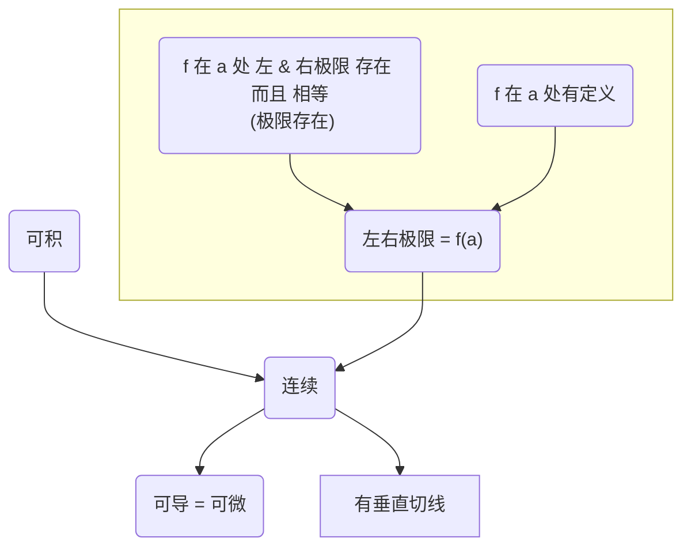

!!! 微积分
	1.	函数 & 模型
		- 复习题 (p89 - p717)
			- 设 f 的定义域为 A，g 的定义域为 B： f+g, fg, f/g' 的定义域是什么 (9)
			- f o g 的定义域 (10), f 的变换 (11)
			- $\sin^{-1} x, \cos^{-1} x, \tan^{-1} x, \cdots$ 的 定义，定义域，值域 (13)
			- 垂直直线最多与函数图像相交一次？ (判断 5) - true
			- 函数普通变换的组合图像如何画出 - x 轴 和 y 轴 方向的图像分别考虑？考虑某个轴的变换需要看结合性？ (练习题 9)
			- 函数 普通变换 && 反函数 / 复合 的组合图像 (练习 10)
			- 画精确函数图像的步骤 (参考第 4 章) (练习 11-16)
			- 语言描述 转化为 解析表达 (练习 18)
			- 函数复合 && 定义域 (练习 19)
			- 函数拆解为 多个函数的复合 (练习 20)
			- 根据离散图选择一个合理的 函数模型，并预测 (练习 21)
			- 给定原函数 f，求 $f^{-1}(a)$ (练习 23)
			- 给出表达式的精确值 (练习 25)
			- 元素衰变模型 (练习 27)  (tip： 不同于 种群增长模型！！！)
			- 函数族图像 (练习 29, 30)   (tip： 注意一个函数如何表现时该函数有 x轴 或 y轴 的变换，注意 变换 和 复合 容易混淆)
		- 解题原则 (p91)
			- 
	2.	极限 & 导数
		- 复习题 (p190 - p723)
			- {==极限不存在==}的情形 (2)
				```
				趋于无穷大 或 振荡
				递归定义：左右极限不存在 或 左右极限存在但不相等(如：|x|在 0 处的变化率)
				```
			- 枚举 & 阐述 极限定理 (3)
				- 假设 f 和 g 都存在：和/差/乘/商/常数乘积 法则
				- 幂函数法则 ($a=\frac 1n$ 或 $a = n$，$n\in N^+$)，有理函数直接替换性质 (前提：x 处有定义)
				- 不等式法则，夹逼原理
				- 复合函数极限定理 (f 在 g(x) 上连续)
			- 垂直 / 水平渐近线 (5/6)
			- {==连续==} (7)
				- 左右极限存在且相等，并且等于函数值
			- 中值定理 (8)
			- 可微，可微 & 连续 (13)
				- 连续 但 不可微 的点：尖点（如：|x| 在 0 处）
			- 不可微的情形 (14)
			- 判断 (判断题 1~18，尤其是 15, 16)
			- 极限存在性 / 水平渐近线 / 垂直渐近线 / 不连续 (练习 1)
			- 求极限 (练习 3-22)
				- $\lim\limits_{x\to 0} \frac {1-\sqrt{1-x^2}}{x}$ 试试Taylor会怎么样
				- $\lim\limits_{x\to 9} \frac {\sqrt r}{(r-9)^4}$ 能否用洛必达
				- $\lim\limits_{x\to +∞} \frac {\sqrt {x^2-9}}{2x-6}$ 用什么方法最合适
			- $\frac {(\cos x)^2}{x^2}, \sqrt {x^2+x+1} - \sqrt {x^2-x}$ 的渐近线 (注意 $|x| = \sqrt {x^2}$)
			- 极限的严格证明 (练习 27-30)
			- 证明连续 (练习 33-34)
			- 证明有根 (练习 35-36)
			- 切线 (练习 37)
			- 根据函数图像画出导函数图像 (练习 44-46)
			- 导数定义求f'... (练习 47-48)
			- 不可微点的判断 (练习 49)
				```title="满足以下条件之一即为不可微点"
				1.	不连续：$f_x \to ±∞$ (垂直渐近线) 或 f 左右极限不等(跳跃间断) 或 f 振荡
				2.	竖直切线：$f'(x) \to ±∞$
				3.	拐角处(尖角)：f' 左右极限不等
				4.	f' 振荡
				```
			- 函数 图像 或 图表 估计导函数值 (练习 50-51)
			- 夹逼 (练习 53)
		- 附加题 (p194)
			- 

!!! note "极限"
	- [极限大杀器——Taylor公式](https://zhuanlan.zhihu.com/p/412006280)
		- $\sqrt {1 ± x^2}$ 只有偶数项非零
		- 泰勒展开的项数 {==不大于==} 与之相对的项数
		- 在使用 Taylor 之前分离所有可能的 常数 或 非0非∞的极限(转换为常数)，只有这样才能把握好 Taylor展开的 项数
	- 遇到 $\frac 1x$ 的复合，不宜直接用 Taylor
	- 遇到分母的不存在的极限，适宜用 L'hospital
	- $1^∞$ 的两种做法，如 $f(x)^{g(x)}$：
		1.	$\lim f^g = e^{\lim (f-1)g}$
		2.	$\lim f^g = e^{\lim g\ln (f-1)}$ （仅当 g 有明显的分母时才好用）
	- 遇到诸如 $n!$ 的非初等函数？
		- 夹逼
	- $\frac00$ 不定型意味着可以尝试消去公分母
	- 代换
		- 正向代换：$t = f(x)$
		- 逆代换(逆换元)：$x = f(t)$，最常用的是 用于积分的三角代换
		- 隐式代换：$F(x, t) = 0$
			- “万能代换”：令 $t = \tan {\frac x2}$ $\implies$ $\displaystyle \sin x = \frac {2t}{1+t^2}, \cos x = \frac {1-t^2}{1+t^2}$
			- 如果函数出现变量序列 $\displaystyle A = \{ x^{\displaystyle \frac 1{n_i}} \}$，可以令 $\displaystyle t = x^{\displaystyle \frac 1{gcd(n_i)}}$  ($n_i\in N^+$)，有 $x^{\displaystyle \frac 1{n_i}} = t^{\displaystyle \frac {gcd(n_i)}{n_i}}$





!!! question
	- Taylor 应该展开多少项？

!!! 杂项
	- $\lfloor -x\rfloor = -\lceil x\rceil$
	- $|x| = \sqrt {x^2}$
