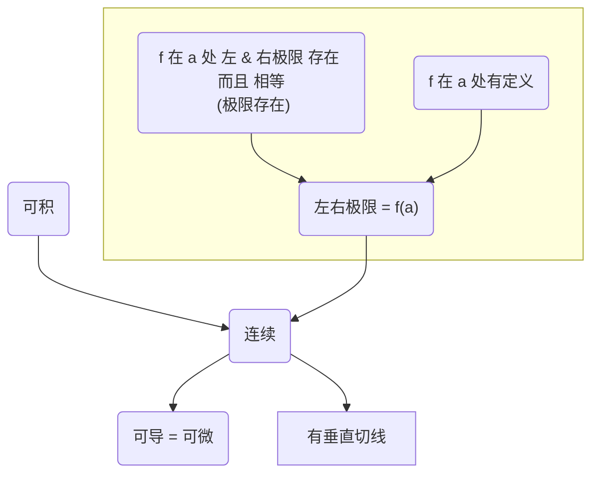

!!! 微积分
	1.	函数 & 模型
		- 复习题 (p89 - p717)
			- 设 f 的定义域为 A，g 的定义域为 B： f+g, fg, f/g' 的定义域是什么 (9)
			- f o g 的定义域 (10), f 的变换 (11)
			- $\sin^{-1} x, \cos^{-1} x, \tan^{-1} x, \cdots$ 的 定义，定义域，值域 (13)
			- 垂直直线最多与函数图像相交一次？ (判断 5) - true
			- 函数普通变换的组合图像如何画出 - x 轴 和 y 轴 方向的图像分别考虑？考虑某个轴的变换需要看结合性？ (练习题 9)
			- 函数 普通变换 && 反函数 / 复合 的组合图像 (练习 10)
			- 画精确函数图像的步骤 (参考第 4 章) (练习 11-16)
			- 语言描述 转化为 解析表达 (练习 18)
			- 函数复合 && 定义域 (练习 19)
			- 函数拆解为 多个函数的复合 (练习 20)
			- 根据离散图选择一个合理的 函数模型，并预测 (练习 21)
			- 给定原函数 f，求 $f^{-1}(a)$ (练习 23)
			- 给出表达式的精确值 (练习 25)
			- 元素衰变模型 (练习 27)  (tip： 不同于 种群增长模型！！！)
			- 函数族图像 (练习 29, 30)   (tip： 注意一个函数如何表现时该函数有 x轴 或 y轴 的变换，注意 变换 和 复合 容易混淆)
		- 解题原则 (p91)
	2.	极限 & 导数
		- 复习题 (p190 - p723)
			- 极限不存在的情形 (2)
			- 枚举 & 阐述 极限定理 (3)
			- 垂直 / 水平渐近线 (5/6)
			- 中值定理 (8)
			- 连续 (7)
			- 可微，可微 & 连续 (13)
			- 不可微的情形 (14)
			- 判断 (判断题 1~18，尤其是 15, 16)
			- 极限存在性 / 水平渐近线 / 垂直渐近线 / 不连续 (练习 1)
			- 

!!! note "极限"
	- [极限大杀器——Taylor公式](https://zhuanlan.zhihu.com/p/412006280)
		- $\sqrt {1 ± x^2}$ 只有偶数项非零
		- 泰勒展开的项数 {==不大于==} 与之相对的项数
		- 在使用 Taylor 之前分离所有可能的 常数 或 非0非∞的极限(转换为常数)，只有这样才能把握好 Taylor展开的 项数
	- 遇到 $\frac 1x$ 的复合，不宜直接用 Taylor
	- 遇到分母的不存在的极限，适宜用 L'hospital
	- $1^∞$ 的两种做法，如 $f(x)^{g(x)}$：
		1.	$\lim f^g = e^{\lim (f-1)g}$
		2.	$\lim f^g = e^{\lim g\ln (f-1)}$ （仅当 g 有明显的分母时才好用）
	- 遇到诸如 $n!$ 的非初等函数？
		- 夹逼

!!! question
	Taylor 应该展开多少项？

