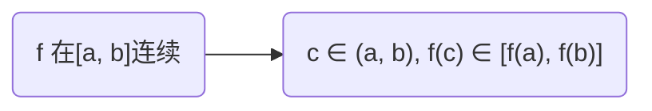
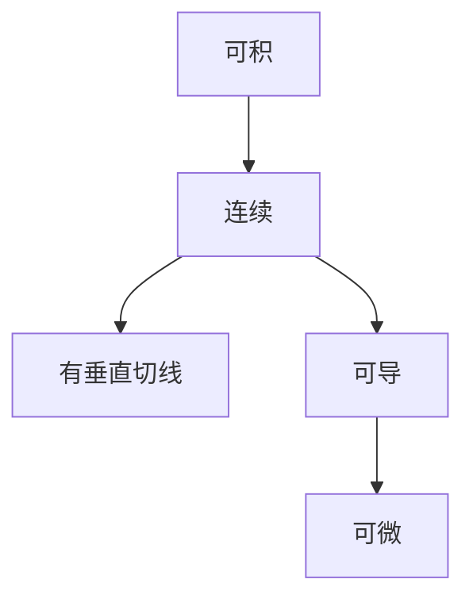

###  ###

### 1.切线和速度问题 ###

### 2.函数的极限 ###


!!! note "极限 定义"
> $\lim_{x \to a} f(x) = L$
> 当 x 趋于 a 时，函数 f(x) 的极限等于 L
> 如果我们可以通过让 x 充分地接近 a (在 a 的两边均可)，但不等于 $a (x\ne a)$，
> 使得到f(x)的值任意地接近 L
> 
> 另一种表达：$x \to a, f(x) \to L$


!!! warning
	- f(x) 无需在 x=a处有定义，我们只需关注 x=a 附近f(x)是如何定义的
		- 也就是说，求极限时可以先清楚3个事情： x=a左侧，x=a右侧，x=a(无需考虑)
		- 无论 f(x) 在 x=a 处取何值，都与其在此处的极限无关
	- 计算机计算极限时由精度问题会出现计算错误的情况
	- 若两侧极限取不同值时，极限不存在

!!! note "单侧极限"
> 如果 x 充分接近 a 且 x 小于 a 时，则称当 x 趋近于 a 时f(x)的左极限等于 L, 
> 	记为 $\lim_{x \to a^-}f(x) = L$
> 如果 x 充分接近 a 且 x 大于 a 时，则称当 x 趋近于 a 时f(x)的右极限等于 L, 
> 	记为 $\lim_{x \to a^+}f(x) = L$

```title="单侧极限 & 两侧极限"
\lim_{x \to a}f(x) = L  \iff  \lim_{x \to a^-}f(x) = L & \lim_{x \to a^+}f(x) = L
```

```title="无穷大极限"
设 f 是一个函数它在 a 的两边都有定义(a点本身可能除外)，那么 \lim_{x \to a} f(x) = +∞
表示当 x 充分地靠近但不等于 a 时，f(x) 的值可以任意的大

另一种表示方法： f(x) \to +∞， 当 x \to a
```

!!! warning
	- ∞既不表示一个数，也不表示极限存在，{==它只是极限不存在的一种特殊表示==}
	- $\lim\limits_{x \to a} f(x) = +∞$ 读作"当x趋近于a时，f(x)的极限是/变得无穷大" 或 "当x趋近于a时，f(x)无界地增长"

```title="无穷大极限"
设 f 是一个函数它在 a 的两边都有定义(a点本身可能除外)，那么 \lim_{x \to a} f(x) = -∞
表示当 x 充分地靠近但不等于 a 时，f(x) 的值是绝对值任意大的负数

另一种表示方法： f(x) \to -∞， 当 x \to a
```

!!! warning
	- $\lim\limits_{x \to a} f(x) = -∞$ 读作"当x趋近于a时，f(x)的极限是/变得负无穷大" 或 "当x趋近于a时，f(x)无界地减少"

```title="垂直渐近线"
直线 x = a 称为曲线 y = f(x) 的垂直渐近线，如果下面的条件至少满足一个：
	- \lim_{x \to a} f(x) = +∞, \lim_{x \to a^-} f(x) = +∞, \lim_{x \to a^+} f(x) = +∞
	- \lim_{x \to a} f(x) = -∞, \lim_{x \to a^-} f(x) = -∞, \lim_{x \to a^+} f(x) = -∞
```

### 3.利用极限运算法则求极限 ###

正确函数极限函数值不见得总是能通过猜测来得到，如下给出极限的一些性质，称为 极限法则，来计算极限

!!! note "{==极限法则==}"
> 假设 c 是一个常数，极限 \lim_{x \to a}f(x) 和 \lim_{x \to a}g(x) 存在，那么：
> 
> 	1.	$\lim_{x \to a}[f(x) + g(x)] = \lim_{x \to a}f(x) + \lim_{x \to a}g(x)$
> 	2.	$\lim_{x \to a}[f(x) - g(x)] = \lim_{x \to a}f(x) - \lim_{x \to a}g(x)$
> 	3.	$\lim_{x \to a}[f(x) * g(x)] = \lim_{x \to a}f(x) * \lim_{x \to a}g(x)$
> 	4.	$\lim_{x \to a}[f(x) / g(x)] = \lim_{x \to a}f(x) / \lim_{x \to a}g(x) & \lim_{x \to a}g(x) != 0$
> 	5.	$\lim_{x \to a}[c * f(x)] = c * \lim_{x \to a}f(x)$
> 
> // 分别称为 和/差/乘/商/常数乘积 法则

!!! tip
	极限法则 可以通过 极限的严格定义 证明

!!! note "{==其他极限法则==}"
> 6.	$\lim_{x \to a}f(x)^n = [\lim_{x \to a}f(x)]^n  &  n 是正整数$
> 7.	$\lim_{x \to a}c = c$
> 8.	$\lim_{x \to a}x = a$
> 9.	$\lim_{x \to a}x^n = a^n$
> 10.	$\lim_{x \to a}\sqrt[n]{x} = \sqrt[n]{a}  &  n是正整数(如果n是偶数，我们假设 a>0)$
> 11.	$\lim_{x \to a}\sqrt[n]{f(x)} = \sqrt[n]{\lim_{x \to a}f(x)}$


!!! tip
	上述6个法则均与超越函数无关

note "直接替换性质"
如果 f 是一个 多项式 或 有理函数，a 在 f 的定义域里，那么 $\lim_{x \to a} f(x) = f(a)$


!!! tip
	- 对于一个分数，其分母的一部分因子在 a 处没有定义，可以尝试通过初等代数消去分子和分母的相同因子来计算极限

!!! note
	- p199 - 关于牛顿的经历

!!! note "定理"
> 1.	$\lim_{x \to a}f(x) = L  \iff  \lim_{x \to a^-}f(x) = L = \lim_{x \to a^+}f(x)$
> 2.	如果 x 在 a 附近时(除了在a处) $f(x) \le g(x)$，并且 x趋于 f 和 g 时的极限都存在，
> 	那么 $\lim_{x \to a}f(x) \le \lim_{x \to a}g(x)$
> 3.	夹逼原理 - 如果 x 在 a 附近时(除了在a处) f(x) \le g(x) \le h(x)，
> 	并且 $\lim_{x \to a}f(x) = \lim_{x \to a}g(x) = L$，那么 $\lim_{x \to a}g(x) = L$

!!! tip
	- 夹逼原理通常运用在超越函数的精确上下界(如：对于某些三角函数具有精确的常数上下界；某些常见的不等式)
	- $\lim\limits_{x\to0}sin{\frac1x}$极限不存在

!!! note
	- 夹逼原理 有时称为 "三明治定理" 或 "摘心定理"

### 4.极限的严格定义 ###

!!! waring
	以下含有高难度定义，不要崩溃

```title="极限的严格定义"
设 f 为定义在某个包含a的开区间上的函数（在 a 处可能没有定义），
如果对于任意 \epsilon > 0，都存在一个 \delta > 0，
只要 0 < |x-a| < \delta 都有：  |f(x) - L| < \epsilon，
那么我们说 x 趋于 a 时 f(x) 的极限是 L，记为：\lim_{x \to a}f(x) = L

自然语言定义：
\lim_{x \to a}f(x) = L 表示通过将 x 与 a 之间的距离变得充分小（但不为0），
可以使 f(x) 与 L 之间的距离变得任意小

或者：
\lim_{x \to a}f(x) = L 表示通过使 x 与 a 足够地靠近（但不等于 a），
可以使 f(x) 与 L 之间的距离任意地靠近

集合的解释：
给定 \epsilon > 0, 能够找出足够小的 \delta > 0，使得
{x | 0<|x-a|<\delta} 能够全部映射到 {f(x) | |f(x)-L|<\epsilon} 之内

// 几何方面的描述。。。
```

??? 如何理解
	在证明极限时，将极限定义看成是一场对抗，可能会是有益的．首先 $\epsilon$ 向你挑战，你必须能够拿出一个适合的 $\delta$ 与之抗衡，你必须能够对付每一个 \epsilon > 0，而不只是某个特殊的 \epsilon

!!! tip
	关于极限的严格定义的更多内容，参考p128

```title="无穷大极限"
无穷大极限:
	- 设 f 是定义在某个包含 a 的开区间（可能不包含a本身）上的一个函数。那么 \lim_{x \to a}f(x) = +∞
		表示对于每个正数M，存在一个正数 \delta，使得当 0 < |x-a| < \epsilon 时，有 f(x) > M
	- 设 f 是定义在某个包含 a 的开区间（可能不包含a本身）上的一个函数。那么 \lim_{x \to a}f(x) = -∞
		表示对于每个负数N，存在一个正数 \delta，使得当 0 < |x-a| < \epsilon 时，有 f(x) < N
```

### 5.函数的连续性 ###

```title="函数的 连续性"
函数 f 在 a 点连续，如果  \lim_{x \to a}f(x) = f(a)
```

!!! tip "该定义隐含了三件事情"
	1.	f(a) 有定义 (即 a 在 f 的定义域里)
	2.	$\lim\limits_{x\to a}f(x)$存在
	3.	$\lim\limits_{x\to a}f(x) = f(a)$

```title="函数的 左右连续性"
函数 f 在 a 点左连续，如果 \lim_{x \to a^-}f(x) = f(a)
函数 f 在 a 点右连续，如果 \lim_{x \to a^+}f(x) = f(a)
```

```
函数 f 在一个区间上是连续的，如果它在区间内没一点都连续
(在端点连续表示 右连续或是左连续)
```

```title="定理(p140)"
如果函数 f 和 g 在a点连续，且 c 是一个常数，那么下列函数在a点也连续：
	- f + g, f - g, c * f, f * g, f / g & g(a) != 0

// 即任意个连续函数的线性组合都能构成连续函数（而 除法 可能损失 定义域）
```

```title="定理"
1.	多项式 在每一点处都连续，即它在 R = (-∞, +∞) 上连续
2.	有理函数 在每一个有定义的点都连续，即它在自己的定义域上连续
```

```title="定理(默认连续函数)"
以下函数在定义域内处处连续：
	- 有理函数（多项式，平方根函数）
	- 常见的超越函数：三角函数，反三角函数，指数函数，对数函数
```

```title="定理(极限符号互换？)"
如果 f 在 b 点连续，并且 \lim_{x \to a}g(x) = b，那么
	\lim_{x \to a}f(g(x)) = f(b)
即	\lim_{x \to a}f(g(x)) = f(\lim_{x \to a}g(x))
```

```title="定理(“连续函数的连续函数也是连续函数”)"
如果 g 在 a 连续 & f 在 g(a) 连续，那么 f o g 也在 a 连续

// 对此定理做一个连续的“迭代”即可扩展到区间上的问题
```

```title="介值定理"
假设 {==f 在 [a, b] 上连续==}， N \in [f(a), f(b)] （其中 f(a) != f(b), 可说明 a != b），
那么，存在 c \in (a, b)，使得 f(c) = N
```

!!! note "我的理解"
	f 在 [a, b] 连续，那么，对于满足 $y\in[f(a), f(b)]$ 局部值域的每一点y，都能映射到满足$x\in[a, b]$多个定义域上的点x



!!! tip
	- 介值定理通常可以用来求函数(只需要某个区间连续)的零点
	- 如果能确定某些连续区间内可能有零点，那么可以用算法(比如：二分)来求精确解

### 6.无穷远的极限及水平渐近线 ###

```title="无穷远处的极限"
- 设 f 是一个定义在 (a, ∞) 上的函数，
那么 \lim_{x \to +∞}f(x) = L 表示通过让 x 足够的大，可以使 f(x) 的值任意的接近 L

- 设 f 是一个定义在 (-∞, a) 上的函数，
那么 \lim_{x \to -∞}f(x) = L 表示通过让 x 从负方向足够的大，可以使 f(x) 的值任意的接近 L
```

```title="水平渐近线"
指向 y = L 称为曲线 y = f(x) 的水平渐近线，如果 \lim_{x \to +∞}f(x) = L 或 \lim_{x \to -∞}f(x) = L
```

!!! note
	- $\lim\limits_{x\to-\infty}tan^{-1}{x} = -\frac{\pi}{2}$
	- $\lim\limits_{x\to+\infty}tan^{-1}{x} = \frac{\pi}{2}$
	- $\lim\limits_{x\to-\infty}e^x = 0$

```title=""
如果 r > 0 是一个有理数，那么 \lim_{x \to +∞}\frac{1}{x^r} = 0

如果 r > 0 是一个 使 x^r 对所有x都有定义的有理数，那么 \lim_{x \to -∞}\frac{1}{x^r} = 0
```
a*(x-2)/(x^2-b)

!!! waring
	- 不要用某些定式思维解某些极限问题，比如有理函数中的多项式切勿直接代入无穷来求极限，而要把分母每一项的次数不大于0

!!! 解题要点
	- 计算有理函数无穷远处的极限，通常将分子和分母同时除以分母最高次项
	- 计算两个单项式相减，可以考虑分子和分母同时乘以共轭根式
	- $\sqrt[n]{x^n}=|x|~~\&~~2\mid n$
	- 无理函数(通常指 正整数的倒数次方的幂函数)可以通过引入中间变量化简(但是必须注意原变量取极限时，中间变量取何值)

!!! warning
	- 无穷大极限不能用 "极限法则" 来求解，因为$\infty$不是一个数字
	- 对多个无穷大做运算是没有意义的(而乘积或加法除外？)，但是极限的结果可以用无穷大表示

```title="无穷远处的极限 - 严格的定义"
设 f 是一个定义在某个区间 (a, +∞)上的函数，那么 \lim_{x \to +∞}f(x) = L
表示对于任意的 \epsilon > 0，总存在一个数 N，使得 x > N 时，有 |f(x) - L| < \epsilon

设 f 是一个定义在某个区间 (-∞, a)上的函数，那么 \lim_{x \to -∞}f(x) = L
表示对于任意的 \epsilon > 0，总存在一个数 N，使得 x < N 时，有 |f(x) - L| < \epsilon
```

```title="无穷远处的无穷大极限"
设 f 是一个定义在某个区间 (a, +∞)上的函数，那么 \lim_{x \to +∞}
表示对于任意正数 M，相应的总存在一个正数 N，使得 当 x > N 时，f(x) > M
```

### 7.切线、速度&其他变化率 ###

!!! 切线斜率
	- 曲线 y=f(x) 在点 P(a, f(a)) 处的切线是一条过点 P 且斜率为 
	$m=\lim\limits_{x\to a}\frac{f(x)-f(a)}{x-a}$ 的直线，如果上式极限存在
	- 切线斜率另一种表示： $m=\lim\limits_{h\to0}\frac{f(a+h)-f(a)}{h}$  (在x=a处的斜率)


### 8.导数 ###


!!! 导数定义
> 如果极限 $\lim\limits_{h\to0}\frac{f(a+h)-f(a)}{h}$ 存在
> 
> 则函数 f(x) 在 x=a 处的导数 $f'(a)$ 定义为：$f'(a)=\lim\limits_{h\to0}\frac{f(a+h)-f(a)}{h}$
> 
> 又或者： $f'(a)=\lim\limits_{x\to a}\frac{f(x)-f(a)}{x-a}$

!!! 导数的解释
> 曲线 y = f(x) 在点 (a, f(a)) 的切线是一条过点 (a, f(a))，斜率为 f'(a) 是直线
> 
> 导数 $f'(a)$ 是函数 y = f(x) 关于 x 在 x=a 处的瞬时变化率 $\lim\limits_{\Delta x\to 0}\frac{\Delta{y}}{\Delta{x}} = \lim\limits_{x2\to x1}\frac{f(x2)-f(x1)}{x2 - x1}$
> 

### 9.导函数 ###

!!! 导函数
> 迭代导数中的a，扩展至函数 f 的定义域的子集，得到 $f'(x)=\lim\limits_{h\to0}\frac{f(x+h)-f(x)}{h}$ & $定义域=\{x | f'(x)存在\}$

!!! 其他符号
> 导数的一些通用记号如下：
> 
> $f'(x) = y' = \frac{d_y}{d_x}= \frac{d_f}{d_x} = \frac{d}{d_x}f(x) = D~f(x) = D_x~f(x)$
> 
> 可以用莱布尼茨公式重写导数：$\frac{d_y}{d_x} = \lim\limits_{\Delta x\to 0}\frac{\Delta x}{\Delta y}$
> 
> 特殊点处的导数：$\left. \frac{d_y}{d_x}\right|_{x=a}$ 或 $\left. \frac{d_y}{d_x}\right]_{x=a}$
> 

!!! 可微
> 如果 f'(a) 存在，则称 f 在点 a 是可微的

> 如果 f 在开区间 (a, b) [或 (a, +∞), (-∞, a), (-∞, +∞)]，则称 f 在开区间 (a, b) 上是可微的

!!! note "连续(单边极限定理)"
> 如果 f 在 a 点可微，则 f 在 a 点连续

!!! 不可微的判断
> 1.	函数图像有“隅角" 或 “纽结”
> 2.	如果 f 在 a 点不连续，则 f 在 a 点不可微
> 3.	曲线在 x=a 有垂直切线，则 f 在 a 点连续，且 $\lim\limits_{x\to a}|f'(x)|=∞$


!!! 函数性质关系树


