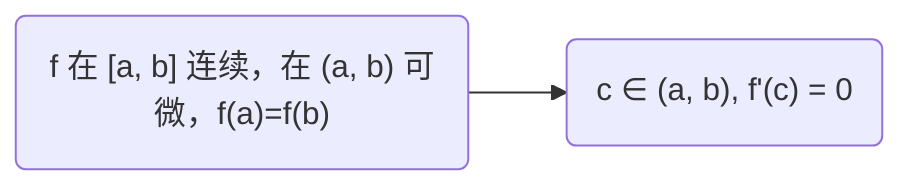

### 1.最值 ###

!!! 最值定义
> - 最大值：如果一个函数f在点 c 满足 $f(c) \ge f(x)$ 对于所有的 $x\in D$ 都成立(D 为函数的定义域)，那么就称函数 f 在 c 点有具有绝对最大值(全局最大值)，f(c) 的值称为函数 f 在定义域 D 中的最大值
> - 最小值：如果一个函数f在点 c 满足 $f(c) \le f(x)$ 对于所有的 $x\in D$ 都成立(D 为函数的定义域)，那么就称函数 f 在 c 点有具有绝对最小值(全局最小值)，f(c) 的值称为函数 f 在定义域 D 中的最小值
> - 最值：最大值和最小值统称为函数 f 的最值

!!! 极值定义
> - 极大值：当 x 在点 c 附近都有 $f(c) \ge f(x)$，那么就称函数 f 在点 c 有一个极大值 [也就是说在一些包含点 c 的开区间中，所有的 x 都满足 $f（c）\ge f(x)$ ]
> - 极小值：当 x 在点 c 附近都有 $f(c) \le f(x)$，那么就称函数 f 在点 c 有一个极小值

!!! 最值定理
> {==闭区间==} [a，b] 上{==连续==}函数 f 一定可以在 [a,b] 上某点 c 和 d 取到最大值和最小值 f(c) 和 f(d)

!!! note "fermat 费马定理p(296)"
> 如果 f 子在点 c 有极大值或者极小值，并且 f'(c) {==存在==}，那么 f'(c) = 0

!!! tip "费马定理 可能出错的点"
	- 证明过程参见 p296
	- 其逆命题不总是成立，即不能简单的用 导数零点 求 极值，参考 $x^3$ 在 x=0 处的例子
	- 定理成立的条件之一是 c处的导数存在，参考 $|x|$ 在 x=0 处的例子

!!! note "临界值 & fermat定理的重新定义"
> f 的临界值：f 的定义域中满足条件的点 c：f'(c) = 0 或 f'(c) 不存在
> 
> 如果 f 在 c 点有极值，那么 c 是临界值

!!! note "闭区间方法(最值求法)"
> f 在 {==闭区间==} [a, b] 上 {==连续==}
> 
> 1.	求 (a, b) 上临界值对应的函数值
> 2.	求 f 在区间端点处的值
> 3.	从上述值中取 最大值 和 最小值

### 2.中值定理 ###

!!! note "rolle定理"
> 若 f 满足：
> 
> 1.	f 是闭区间 [a, b] 上的连续函数
> 2.	f 在开区间 (a，b) 内可微
> 3.	f(a) = f(b)
> 
> 那么，在区间 (a, b) 上存在一个数使得 f'(c) = 0

!!! note "langrange中值定理"
> 若 f 满足：
> 
> 1.	f 是闭区间 [a, b] 上的连续函数
> 2.	f 在开区间 (a，b) 内可微
> 
> 那么，在区间 (a, b) 上存在一个数 c 使得 $f'(c) = \frac {f(b) - f(a)}{b - a}$ 或 $\frac {\Delta y}{\Delta x}$
> 
> 或者，等价地： $f(b) - f(a) = f'(c) (b - a)$ （可以证明导数的符号与函数增减的关系） 或 $\Delta y = f'(c) \Delta x$

!!! tip
	- langrange中值定理 的证明用到了 rolle定理（参见 p305~306）
	- langrange中值定理 的条件在如下情况时自动满足：f 可导 或 f 可微（可微 意味着 连续）
	- langrange中值定理 表明了 两个点及其函数值 和 两点之间的某点的函数值 之间的 不等式关系
	- 如何理解：a 和 b 之间存在一点 c，该点的瞬时变化率 等于 a和b之间的平均变化率

!!! note "cauchy中值定理"
> 若 f 和 g 满足：
> 
> 1.	闭区间 [a, b] 上的连续
> 2.	开区间 (a，b) 内可微
> 3.	那么，在区间 (a, b) 上存在一个数 c 使得 $f'(c) = g'(c)\frac {f(b) - f(a)}{g(b) - g(a)}$  &  $g'(c) \ne 0$
> 
> 或者，等价地：$\frac {f'(c)}{g'(c)} = \frac {f(b) - f(a)}{g(b) - g(a)}$
>
> 使用 Leibniz 记号： $\frac {d_f}{d_x} = \frac {d_g}{d_x} \frac {\Delta f}{\Delta g}$ 或 $\frac {\frac {d_f}{d_x}}{\frac {d_g}{d_x}} = \frac {\Delta f}{\Delta g}$ （即 $\frac {d_f}{d_g} = \frac {\Delta f}{\Delta g}$）
> 
> 几何意义：假设有参数方程 $x = f(t), y = g(t)$，f 和 g 在 [a, b]连续，(a, b)可微
> 
> 	- 那么，存在 $c\in (a, b)$，$\frac {d_x}{d_y} = \frac {\Delta x}{\Delta y}$，即 (a, b) 上至少存在一点，它的 切线斜率 等于 割线斜率 （即 差分之比 或 平均变化率）

!!! note "常数函数 判定 && 引理"
> 若在 (a, b) 内恒有 f'(x) = 0，那么在 (a, b) 内 f 为常数
> 
> 引理：若在 (a, b) 内恒有 f'(x) - g'(x) = 0，那么在 (a, b) 内 f-g 为常数，也就是说 f(x) = g(x) + c (c 为常数)
> 
> 结论：$\tan^{-1}x + \cot^{-1}x = \frac \pi2$

### 3.导数在绘图上的应用 ###

!!! 单调性判定
> 增函数：如果在某个区间内 f'(x)>0，那么f在这个区间里是增函数
> 减函数：如果在某个区间内 f'(x)<0，那么f在这个区间里是减函数

!!! note
	- 单调性判定 的证明用到了 langrange中值定理

!!! note "(极值)一阶导数判别法"
> (a) 极大值：如果在 c 点，f'由正变为负，那么f在c点有一个极大值
> 
> (b) 极小值：如果在 c 点，f'由负变为正，那么f在c点有一个极小值
> 
> (c) 无极值：如果在 c 点，f'的符号不发生改变(例如，f'在c点两侧都是正, 或都是负), 那么f在c点没有极大值和极小值.

!!! 凹性
> -	上凹：如果一个函数f在区间 I 的图形位于它的所有的切线的上方，那么 f称为在区间 I 上凹
> -	下凹：如果一个函数f在区间 I 的图形位于它的所有的切线的下方，那么f称为在区间 I 下凹

!!! 凹性判别法
> (a) 如果对区间 I 中的任意x，都有f"(x)>0，那么在区间 I 函数f的图形是上凹的
> 
> (b) 如果对区间 I 中的任意x，都有f"(x)<0，那么在区间 I 函数f的图形是下凹的

!!! note
	- 该判别法的证明 用到了 lagrange中值定理，参见 附录F

!!! 拐点
> 曲线 y=f(x) 在 P 点连续，并且在 P 点由上凹变为下凹，或者由下凹变为上凹，那么 P 称为曲线的一个拐点

!!! (极值)二阶导数判别法
> 假设 c 点附近 f'' 是连续的
> 
> (a) 当 f'(c)=0 并且 f"(c) > 0，f在 c 点有一个极小值
> 
> (b) 当 f'(c)=0 并且 f"(c) < 0，f在 c 点有一个极大值
> 
> (c) 另外，f"(c) = 0 时，函数可能有 极大值 或 极小值 或 不存在极值

### 4.不定型求导与洛必达法则 ###

!!! note "商的不定型($\frac 00$ 或 $\frac ∞∞$不定型)"
> $\lim\limits_{x\to a} \frac {f(x)}{g(x)}$
> 
> $\frac 00$型：当 $x\to a, f(x)\to 0, g(x)\to 0$ （极限可能存在，也可能不存在）
> 
> $\frac ∞∞$型：当 $x\to a, f(x)\to ∞, g(x)\to ∞$  (分子阶数高 / 分母阶数高 / 分子分母同阶 极限分别为 ∞，0，或 可能存在/不存在)

!!! 洛必达法则
> f 和 g' 可微，并且在 a 附近（可能不包含 a 点）g'(x) = 0, 并且 $\lim\limits_{x\to a}f(x) = 0 | ±∞, \lim\limits_{x\to a}g(x)= 0 | ±∞$ （即 $\frac 00$型 或 $\frac ∞∞$型 的不定型），那么当 $\lim\limits_{x\to a} {f'(x)}{g'(x)}$存在 （或者是 ∞ 或 -∞）
> 
> $\lim\limits_{x\to a} \frac {f(x)}{g(x)} = \lim\limits_{x\to a} \frac {f'(x)}{g'(x)}$
> 
> 注：$x\to a$ 可以替换成 $x\to a^+$，$x\to a^-$，$x\to +∞$，$x\to -∞$
> 
> 另外：f(a) = g(a) = 0，g'连续，并且 g'(a)$\ne$0 时，洛必达法则正确 （证明参见 p323）

!!! note
	- 换句话说：满足一定条件时，函数商的极限 = 导数商的极限
	- 洛必达法则的一般形式的证明参见 附录F
	- $g'(x) \ne 0$ 不是指 $g'(a)\ne 0$ 或 $\lim\limits_{x\to a}g'(x)\ne 0$，但通常指的是 {==分母不能是常数函数==}
	- 洛必达法则是用来解决 {==商的不定型==}，不假思索地使用洛必达会掉进坑里

!!! note "积的不定型($0 \cdot ∞$型不定型)"
> $\lim\limits_{x\to a} f(x)g(x) = 0$
> 
> $\lim\limits_{x\to a} f(x) = 0, \lim\limits_{x\to a} g(x) = +∞ | -∞$
> 
> 如果 f 的影响更大，则极限为 0；如果 f 的影响更大，则极限为 +∞ | -∞；如果 f 和 g 对结果影响差不多，可能这个极限为 某个有限的非零数
> 
> 处理方法： 对 fg 做两种变换：$fg = \frac f{1/g} = \frac g{1/f}$ （选取一种合适的变换可以简化运算）

!!! note "或许我们可以把其称为 异或积(不定型)"

!!! note "差/和 的不定型($∞-∞$)"
> $\lim\limits_{x\to a} [f(x)-g(x)] = 0$
> 
> $\lim\limits_{x\to a} f(x) = +∞, \lim\limits_{x\to a} g(x) = +∞$ （形式化的定义）
> 
> 处理方法：把差转化为商 “通过一个公分母，或者有理化，提出一个公因子” 得到 商的不定型

!!! question
	- 分子分母能否同时乘以某个函数？极限法则是否允许？

!!! 幂的不定型
> $\lim\limits_{x\to a} [f(x)]^{g(x)}$
> 
> - $0^0$型：$\lim\limits_{x\to a} f(x)=0, \lim\limits_{x\to a} g(x)=0$
> - $∞^0$型：$\lim\limits_{x\to a} f(x)=∞, \lim\limits_{x\to a} g(x)=0$
> - $1^∞$型：$\lim\limits_{x\to a} f(x)=1, \lim\limits_{x\to a} g(x)=±∞$
> 
> 处理方法：
> 
> 1）令 $y=[f(x)]^{g(x)}$，则 $\ln y = g(x) \ln f(x)$，最后答案为 $e^{\ln y}$
> 
> 2）$[f(x)]^{g(x)} = e^{g(x) \ln f(x)}$

### 5.曲线绘图 ###

综合几方面的信息：

1.	定义域，范围，对称性
2.	极限，连续，渐近线
3.	导数，切线
4.	零点，极值，单调性，拐点，凹性，洛必达法则

!!! 画曲线的步骤
> 1.	定义域
> 2.	截距：y轴截距 f(0)，x轴截距 (y=0 时的 点集)
> 3.	对称性：
>		1.	f(-x) = f(x) 或 f(-x) = -f(x) 时只需重点关注 x>0 的图像
> 		2.	f(x + p) = f(x) 时只需重点关注 一个周期内的图像
> 4.	渐近线：
> 		1.	水平渐近线：$\lim\limits_{x\to +∞} f(x) = L$ 或 $\lim\limits_{x\to -∞} f(x) = L$
> 		2.	垂直渐近线：$\lim\limits_{x\to a^+} f(x) = +∞$ 或 $\lim\limits_{x\to a^-} f(x) = +∞$ 或 $\lim\limits_{x\to a^+} f(x) = -∞$ 或 $\lim\limits_{x\to a^-} f(x) = -∞$ 
> 		3.	{==斜渐近线==}：$\lim\limits_{x\to ±∞} [f(x) - (m x + b)] = 0$ （f 为 有理函数时 P(x) 必须比 Q(x) 高一阶时渐近线存在，此时 Q(x) 辗转除 P(x)，对商"向下取整"可以得到1次多项式，即渐近线函数；其中余数必然是常数）
> 5.	单调性(递增区间，递减区间)：计算 f'(x) 为 正 / 负 的区间
> 6.	极值(极大值 / 极小值)：
> 		1.	求 f 的临界点c (f'(c) = 0 或 f'(c) 不存在)
> 		2.	使用 一阶导数判别法
> 		3.	c 为 临界点 而 f"(c)$\ne$0时，使用 二阶导数判别法
> 7.	凹性 & 拐点：
> 		1.	计算 f"(x)，使用 凹性判别法
> 		2.	凹性变化的点为 拐点
> 8.	画草图：以虚线画出渐近线，标出截距，最值点，拐点；依据 单调性 和 凹性 穿点；为提高精确性，可计算某些点的斜率和函数值

### 6.用图形计算器绘图 ###

### 7.优化问题 ###

!!! note "求 最值 的一阶导数判别法则"
> 设c为某区间上连续函数f的临界值
> 
> (a)如果对所有 x<c 有 f'(x)>0，对所有 x>c 有 f'(x)<0，则 f(c) 是f的最大值
> 
> (b)如果对所有 x<c 有 f'(x)<0，对所有 x>c 有 f'(x)>0，则 f(c) 是 f的最小值

!!! question
	- p350 例2 的两种解法：
		- 对 $A(r)=2\pi r^2+2\pi r h$ 求导，将$V(r, h) = \pi r^2 h = c$代入 A(r) 中消去 h，再求 A 关于 r 的最值
		- 对 $A(r, h) 和 V(r, h)$ 隐式微分 (h 也看作 r 的函数)，得到 h = 2*r 的关系式
		- 但是 $V(r, h) = c$ 的方程可以把 c 当作常量对待？ (这个方程理应有 3 个变量，但是把第3个变量看作常数就能很好地得到解)

### 8.导数在商业和经济上的应用 ###

### 9.牛顿方法 ###

!!! note "牛顿法 / 牛顿插值法 / 牛顿迭代法"
> 我们要求 $f(x) = 0$ 的解，假设第n次迭代时 $ans = x_n$
> 
> $x_n$处有切线 g：$g(x) - f(x_n) = f'(x_n) \cdot (x - x_n)$，设第n+1次迭代的解为 该方程的零点
> 
> 即 $0 - f(x_n) = f'(x_n) \cdot (x_{n+1} - x_n) \implies x_{n+1} = x_n - \frac {f(x_n)}{f'(x_{n})}$
> 
> 注：$x_0$ 应取一个合适的值，因为有时候 $\lim\limits_{n\to +∞}x_n=r$ 不一定存在 (即级数不收敛)

### 10.原函数 ###

!!! 原函数 定义
> 如果区间 I 上所有 x 都有 F'(x) = f(x)，则函数 F 称为 f 在区间 I 上的一个原函数

!!! 定理
> 如果 F 是 f 在区间 I 上的一个原函数，则 f 在区间 I 上的原函数通式为：$F(x) + C$ (C为常数)
> 
> 注：可以通过lagrange中值定理的推论证明

!!! note "原函数 公式表"
> |函数|原函数特例||函数|原函数特例|
> |:-:|:-:|:-:|:-:|:-:|
> |$cf(x)$|cF(x)|	|$f(x)+g(x)$|$F(x)+G(x)$|
> |$\displaystyle x^n$ & $n \ne -1$|$\displaystyle \frac {x^{n+1}}{n+1}$|	|$\sec^2x$|$\tan x$|
> |$\frac 1x$|$\ln{\mid x\mid}$|	|$\sec x\tan x$|$\sec x$|
> |$e^x$|$e^x$|	|$\displaystyle \frac 1{\sqrt {1-x^2}}$|$\sin^{-1}x$|
> |$\cos x$|$\sin x$|	|$\displaystyle \frac 1{1+x^2}$|$\tan^{-1}x$|
> |$\sin x$|$-\cos x$|	|||

!!! tip
	- 含有函数导数的方程称为 微分方程
	- 原函数应用：通过已知的导函数求原函数通解，再代入一个原函数特解(求得C)，即可得到 导数的原函数
	- 我非正式地将原函数记为 $f^{(-1)}(x) = \int f(x) dx$；n阶原函数： $f^{(-n)}(x)$

!!! note "(一阶){==原函数的几何问题==}"
> 一般地，一个函数的图像 能影响 f 的一/二阶导函数，一/二阶原函数：
> 
> f {==零点==}旁边的{==正负函数值==} $\iff$ $f^{(-1)}$ {==水平渐近线(或待选极值点)==}旁边的{==单调性==} $\iff$ $f^{(-2)}(x)$ {==伪拐点==}旁边的 {==凹性==} （很容易看出，若 f 零点 c 两边附近异号，那么 $f^{(-1)}(c)$ 为极值点，$f^{(-2)}(c)$ 待选拐点；反之一/二阶原函数在 c 处没有极值或拐点）
> 
> 因此，若已知某个导数 f'，根据零点旁边的正负，水平渐近线旁边的单调性，可以分别得到 原函数的水平渐近线旁的单调性 和 原函数的待选拐点旁的凹性

